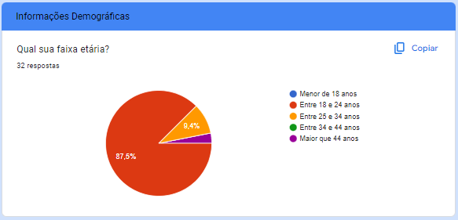
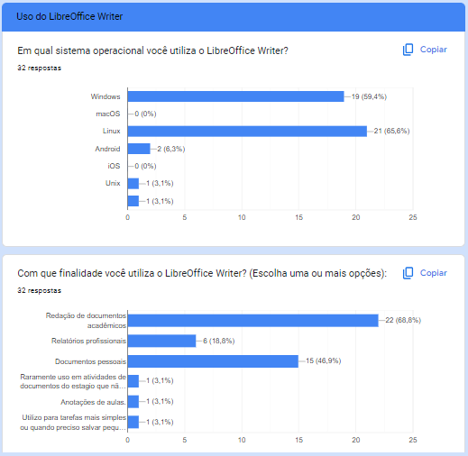
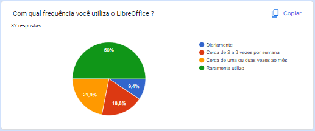
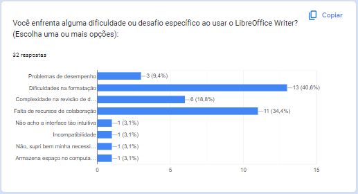
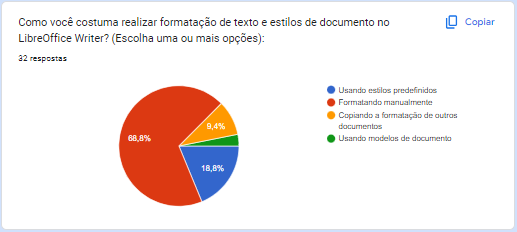

# Questionário 

## Introdução
O questionário foi utilizado principalmente devido sua simplicidade. Ele contém perguntas abertas e fechadas que foram aplicadas durante a fase inicial da elicitação de requisitos. Com ele, pretendemos coletar o máximo de requisitos possíveis de diferentes pessoas que podem estar em lugares distintos. 

## Vantagens do uso de questionário
- Rápida obtenção de dados quantitativos e qualitativos
- Técnica de baixo custeamento
- Obtenção de dados de forma fácil, simultâneamente e numerosas
- Menor tempo de elaboração
- Quando as partes interessada não possuem uma estalagem fixa
- Demanda menor tempo dos respondentes quando comparada a uma entrevista
- Quando o público alvo encontra-se disperso geograficamente
- Quando apresenta uma amostra significativa, é possível inferir uma opinião de toda uma população.

## Desvantagens do uso de questionário
- A baixa taxa de resposta do questionário implicara em um resultado estatisticamente significativo.
- Falhas na elaboração do questionário pode levar a respostas em branco ou não incorretas, gerando um enviesamento da pesquisa podendo se propagar para elicitação de requisitos.
- Maior demanda de tempo caso as escolhas das respostas forem ilimitadas.

## Aplicação do questionário
O questionário foi aplicado utilizando a plataforma online Google Forms e ficou aberto durante um período de 3 dias, entre os dias 01/10/2023 e 03/10/2023.

A página inicial do questionário indica uma explicação e o termo de uso para participar da pesquisa.

Abaixo podemos ver a relação gráfica das respostas obtidas através das 47 respostas ao questionário.

## Informações Demográficas

#### Figura 1: Termo de Consentimento e explicação da pesquisa. (Fonte: Ana Letícia, 2023)

#### Figura 2: Informações sobre o uso do aplicativo. (Fonte: Ana Letícia, 2023)

#### Figura 3: Informações sobre faixa etária. (Fonte: Ana Letícia, 2023) 

#### Figura 4: Informações sobre cidade e estado. (Fonte: Ana Letícia, 2023)

#### Figura 5: Informações sobre o grau de escolaridade e ocupação. (Fonte: Ana Letícia, 2023)

#### Figura 6: Informações sobre o grau de afinidade com o sistema. (Fonte: Ana Letícia, 2023)

#### Figura 7: Informações sobre sistema operacional e finalidade do uso do aplicativo. (Fonte: Ana Letícia, 2023)

#### Figura 8: Informações sobre frequência de uso do aplicativo. (Fonte: Ana Letícia, 2023)

#### Figura 9: Informações sobre funcionalidades mais utilizadas. (Fonte: Ana Letícia, 2023)

#### Figura 10: Informações sobre as dificuldades ao usar o aplicativo. (Fonte: Ana Letícia, 2023)

#### Figura 11: Informações sobre o uso de formatações e estilo. (Fonte: Ana Letícia, 2023)

#### Figura 12:  Informações sobre funcionalidades a serem adicionadas. (Fonte: Ana Letícia, 2023)

#### Figura 13: Informações sobre acessibilidade. (Fonte: Ana Letícia, 2023)

#### Figura 14: Infomrações sobre o uso de algumas ferramentas do aplicativo. (Fonte: Ana Letícia, 2023)

#### Figura 15: Informações sobre o uso da escrita de equações. (Fonte: Ana Letícia, 2023)

#### Figura 16: Informações sobre a escrita de textos em tópicos. (Fonte: Ana Letícia, 2023)

## Satisfação do usuário

#### Figura 17: Informações sobre a opinião da interface. (Fonte: Ana Letícia, 2023)

## Motivo de não usar o LibreOffice (caso marcasse a opção no início do questionário)

#### Figura 18: Informações sobre o não uso do aplicativo. (Fonte: Ana Letícia, 2023)

## Referência Bibliográfica

> GNACIO, Rafael C. Guia Facetado de Técnicas de Elicitação de Requisitos. Universidade Federal de Santa Catarina. 2018. Disponível em: https://retraining.inf.ufsc.br/guia/app/classificacoes/tecnicas-de-elicitacao-de-requisitos/entidades/tecnicas-de-elicitacao-de-requisitos-questionarios

## Histórico de Versão

| Versão | Data       | Descrição                          | Autor(es)     |  Revisor(es)  |
| ------ | ---------- | ---------------------------------- | ------------- | ------------- |
| `1.0`  | 01/10/2023 | Formulação das perguntas           | Ana Letícia   |     Todos     |
| `1.2`  | 01/10/2023 | Criação do questionário            | Ana Letícia   |    Ana Luiza  |
| `1.3`  | 03/10/2023 | Criação do documento               | Ana Letícia   |    Ana Luiza  |
| `1.4`  | 01/10/2023 | Inserção dos gráficos              | Ana Letícia   |    Ana Luiza  |
| `1.5`  | 04/12/2023 | Correções              | Ana Letícia   |    Edilberto  |
