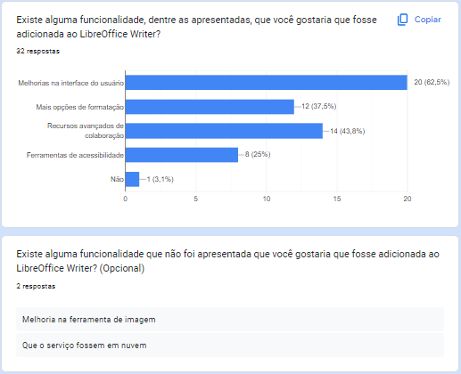

# Questionário 

O questionário foi utilizado principalmente devido sua simplicidade. Ele contém perguntas abertas e fechadas que foram aplicadas durante a fase inicial da elicitação de requisitos. Com ele, pretendemos coletar o máximo de requisitos possíveis de diferentes pessoas que podem estar em lugares distintos. 

## Vantagens do uso de questionário
- Rápida obtenção de dados quantitativos e qualitativos
- Técnica de baixo custeamento
- Obtenção de dados de forma fácil, simultâneamente e numerosas
- Menor tempo de elaboração
- Quando as partes interessada não possuem uma estalagem fixa
- Demanda menor tempo dos respondentes quando comparada a uma entrevista
- Quando o público alvo encontra-se disperso geograficamente
- Quando apresenta uma amostra significativa, é possível inferir uma opinião de toda uma população.

## Desvantagens do uso de questionário
- A baixa taxa de resposta do questionário implicara em um resultado estatisticamente significativo.
- Falhas na elaboração do questionário pode levar a respostas em branco ou não incorretas, gerando um enviesamento da pesquisa podendo se propagar para elicitação de requisitos.
- Maior demanda de tempo caso as escolhas das respostas forem ilimitadas.

## Aplicação do questionário
O questionário foi aplicado utilizando a plataforma online Google Forms e ficou aberto durante um período de 3 dias.

A página inicial do questionário indica uma explicação e o termo de uso para participar da pesquisa.

Abaixo podemos ver a relação gráfica das respostas obtidas através das 47 respostas ao questionário.

## Informações Demográficas

#### Figura 1: Abertura do Questionário

#### Figura 2

 Termo de Consentimento e explicação da pesquisa
 

#### Figura 3

 Termo de Consentimento e explicação da pesquisa
 

#### Figura 4

 Termo de Consentimento e explicação da pesquisa
 

#### Figura 5

 Termo de Consentimento e explicação da pesquisa
 

#### Figura 6

 Termo de Consentimento e explicação da pesquisa
 

## Informações sobre o uso do sistema
#### Figura 7

 Termo de Consentimento e explicação da pesquisa
 

#### Figura 8

 Termo de Consentimento e explicação da pesquisa
 

#### Figura 9

 Termo de Consentimento e explicação da pesquisa
 

#### Figura 10

 Termo de Consentimento e explicação da pesquisa
 

#### Figura 11

 Termo de Consentimento e explicação da pesquisa
 

#### Figura 12

 Termo de Consentimento e explicação da pesquisa
 

#### Figura 13

 Termo de Consentimento e explicação da pesquisa
 

#### Figura 14

 Termo de Consentimento e explicação da pesquisa
 

#### Figura 15

 Termo de Consentimento e explicação da pesquisa
 

#### Figura 16

 Termo de Consentimento e explicação da pesquisa
 

## Satisfação do usuário
#### Figura 17

 Termo de Consentimento e explicação da pesquisa
 

## Motivo de não usar o LibreOffice (caso marcasse a opção no início do questionário)
#### Figura 17

 Termo de Consentimento e explicação da pesquisa
 

## Referência Bibliográfica

> GNACIO, Rafael C. Guia Facetado de Técnicas de Elicitação de Requisitos. Universidade Federal de Santa Catarina. 2018. Disponível em: https://retraining.inf.ufsc.br/guia/app/classificacoes/tecnicas-de-elicitacao-de-requisitos/entidades/tecnicas-de-elicitacao-de-requisitos-questionarios

## Histórico de Versão

| Versão | Data       | Descrição                          | Autor(es)     |  Revisor(es)  |
| ------ | ---------- | ---------------------------------- | ------------- | ------------- |
| `1.0`  | 01/10/2023 | Formulação das perguntas           | Ana Letícia   |     Todos     |
| `1.2`  | 01/10/2023 | Criação do questionário            | Ana Letícia   |    Ana Luiza  |
| `1.3`  | 03/10/2023 | Criação do documento               | Ana Letícia   |    Ana Luiza  |
| `1.4`  | 01/10/2023 | Inserção dos gráficos              | Ana Letícia   |    Ana Luiza  |
