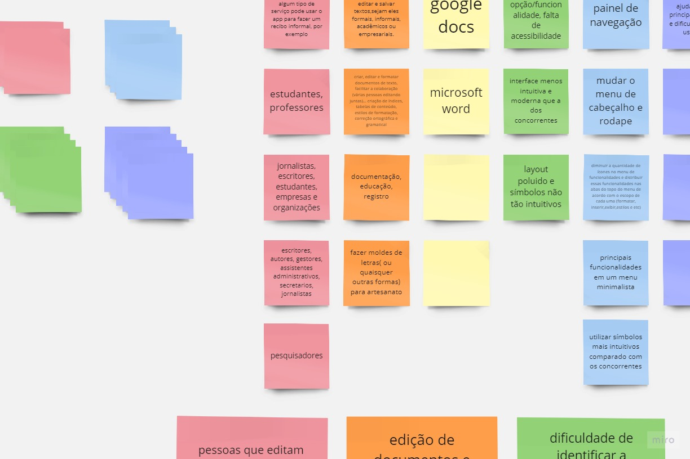

## Introdução

O Brainstorming é uma abordagem que visa obter insights sobre os tipos de conteúdo e funcionalidades que os usuários demandam e desejam em um produto ou serviço. Essa técnica é aplicável a uma ampla gama de produtos e serviços, e resulta na criação de uma lista organizada das necessidades e preferências dos usuários. Em geral, o Brainstorming é utilizado para identificar requisitos e identificar novas características que seriam bem recebidas pelos usuários em um produto. Essa técnica é particularmente valiosa quando aplicada na fase inicial do desenvolvimento do produto. Durante uma sessão de brainstorming, os participantes são encorajados a expressar livremente suas ideias e opiniões em torno de um tópico específico. Os resultados dessa atividade podem ser diretamente incorporados às especificações funcionais e à documentação de design.

## Metodologia

O processo de brainstorming foi realizado via Teams na data de 28/09/2023 de 12:30 até 13:20, onde a integrante Ana Luíza assumiu o papel de moderadora, e os integrantes Ana Letícia, Rafael e Raphaela davam respostas ou ideias com base nos temas que a moderadora colocava em pauta. O processo contou somente com a participação de 3 usuários, mesmo que no livro Interação Humano-Computador (Barbosa e Silva. Página 153)<a id="anchor_1" href="#FRM1">^1^</a> recomenda-se envolver entre 8 e 12 usuários em uma sessão, foram escolhidos somente 3 pela dificuldade de conseguir mais participantes, além da disponibilidade de tempo para realizar a sessão. Os participantes estão listados na Tabela 1.

## Participantes

Tabela 1: Participantes.

| Nome                                                      | Função     |
| --------------------------------------------------------- | ---------- |
|  Ana Luíza Rodrigues          | Mediadora  |
|  Ana Letícia Melo         | Usuário    |
|  Rafael Xavier         | Usuário    |
|  Raphaela Guimarães  | Usuário    |

Fonte: Rafael Xavier.

Ao longo da sessão, a moderadora lançava um tema sobre o aplicativo para que os participantes dessem suas respostas em um quadro na ferramenta Miro em dois minutos, como mostrado na Figura 1.

Figura 1: Quadro de respostas.

Fonte: Rafael Xavier.

## Temas/Respostas

### Quem seria o público-alvo do aplicativo?

 Rafael  
- Alguém que presta algum tipo de serviço pode usar o app para fazer um recibo informal, por exemplo.
- Estudantes, professores.

 Ana Letícia  
- Jornalistas, escritores, estudantes, empresas, organizações e pesquisadores.

 Raphaela 
- Escritores, autores, gestores, assistentes administrativos, secretarios, jornalistas

### Quais são os principais objetivos e funcionalidades do aplicativo?

 Rafael  
- Redigir,formatar, editar e salvar textos,sejam eles formais, informais, acadêmicos ou empresariais.
- Fazer moldes de letras( ou quaisquer outras formas) para artesanato

 Ana Letícia  
- Criar, editar e formatar documentos de texto, facilitar a colaboração (várias pessoas editando juntas)... criação de índices, tabelas de conteúdo, estilos de formatação, correção ortográfica e gramatical

 Raphaela 
- Documentação, educação, registro

### Quais são os principais concorrentes do LibreOffice Writer?

 Ana Letícia, Rafael e Raphaela 
- Google Docs
- Microsoft Word

### Quais são os principais problemas encontrados ao usar as funcionalidades do aplicativo?

 Ana Letícia  
- Interface menos intuitiva e moderna que a dos concorrentes
- Layout poluido e símbolos não tão intuitivos

 Raphaela 
- Muitas opções/ funcionalidades, falta de acessibilidade

### Quais seriam possíveis soluções para esses problemas?

 Ana Letícia, Rafael e Raphaela 

- Painel de Navegação: Implementar um painel de navegação que facilite a movimentação e a localização de partes específicas do documento, tornando-o mais acessível para pessoas com deficiência visual ou mobilidade reduzida.

- Menu de Cabeçalho e Rodapé: Revisar e melhorar o menu de cabeçalho e rodapé, tornando-o mais intuitivo e fácil de usar, o que beneficiará os usuários que precisam acessar e editar essas partes do documento.

- Reduzir a Quantidade de Ícones no Menu de Funcionalidades: Simplificar o menu de funcionalidades, eliminando ícones desnecessários e organizando as funcionalidades em abas no topo, com base em seu escopo (por exemplo, formatar, inserir, exibir, estilos, etc.), para melhorar a usabilidade e a acessibilidade.

- Menu Minimalista: Oferecer um menu minimalista com as principais funcionalidades visíveis, para tornar mais fácil para todos os usuários encontrar e utilizar as funções essenciais do LibreOffice Writer.

- Utilizar Símbolos Mais Intuitivos: Substituir ou aprimorar os símbolos usados na interface do usuário, tornando-os mais intuitivos e compreensíveis, especialmente em comparação com os concorrentes, para que os usuários possam facilmente identificar as funcionalidades.

- Seção de Ajuda: Incluir uma seção de ajuda dedicada com as principais dúvidas e dificuldades dos usuários, proporcionando um recurso de suporte acessível para orientar os usuários e resolver problemas comuns.

- Essas sugestões podem melhorar significativamente a acessibilidade e a usabilidade do LibreOffice Writer, tornando-o mais inclusivo e amigável para todos os tipos de usuários.

| <a id="anchor_BS" style="color:black;"> ID</a> | Descrição                                                       | Código | Implementado |
| ---------------------------------------------- | ------------------------------------------------------------------------------ | ------ | :------: |
| BS01       | O usuário deve poder realizar cadastro                                         | RF01   | Sim |

## Referências Bibliográficas

> <a id="FRM1" href="#anchor_1">1.</a>BARBOSA, S. D. J.; SILVA, B. S. Interação Humano-Computador. Rio de Janeiro: Elsevier, 2011.

## Bibliografia

> Técnicas de Elicitação de Requisitos - Brainstorming. Disponível em: https://retraining.inf.ufsc.br/guia/app/classificacoes/tecnicas-de-elicitacao-de-requisitos/entidades/tecnicas-de-elicitacao-de-requisitos-brainstorming. Acesso em: 02/10/2023.

## Histórico de Versões

| Versão | Data       | Descrição                            | Autor(es)                                      | Revisor(es)                                    |
| ------ | ---------- | ------------------------------------ | ---------------------------------------------- | ---------------------------------------------- |
| `1.0`    | 28/04/2023 | Criação do artefato       | Rafael Xavier   | Artur Seppa |
