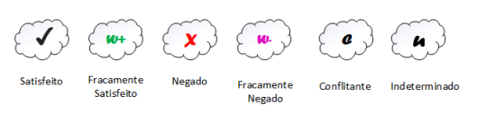

# NFR Framework

## Introdução

O NFR Framework é uma abordagem para representar e analisar Requisitos Não-Funcionais, com o objetivo de ajudar desenvolvedores na implementação de soluções personalizadas, levando em consideração as características do domínio e do sistema em questão. O Framework utiliza o conceito de softgoal, definido como um objetivo que não possui uma clara definição nem critérios de satisfação precisos. O funcionamento do Framework pode ser visualizado por meio de um gráfico de interdependência de softgoal (Softgoal Interdependency Graph (SIG)).

## Softgoal Interdependency Graph - SIG

É um gráfico registra as considerações do desenvolvedor sobre os softgoals e mostra suas interdependências. Trata-se de um gráfico que armazena um registro completo das decisões de desenvolvimento e da lógica do
projeto de forma gráfica e concisa.

## Softgoal

Os "softgoals" são utilizados para descrever Requisitos Não-Funcionais e podem estar conectados entre si, demonstrando como um "softgoal" influencia outro. Softgoals são divididos em três tipos e sua representação gráfica é apresentada na figura 1:

- NFR Softgoals: Representam os requisitos não funcionais;
- Softgoals de Operacionalização: soluções de implementação para satisfazer softgoals NFR, ou seja, representam basicamente funcionalidades;
- Softgoals de Afirmação: Escritos em linguagem natural e se tratam de registros adicionais e argumentativos que podem ser acrescentados ao modelo.

 

 Figura 1: – Tipos de Softgoals (Fonte: CHUNG et al., 2000).

Os softgoals e suas interdependências são representados no SIG. As interdependências definem as relações entre os softgoals e os tipos de interdependências utilizadas pelo framework são os refinamentos e as contribuições. O refinamento é dividido em três tipos e sua representação gráfica é apresentada na figura 2:

- Decomposição de Softgoal NFR: refina ou subdivide um softgoal NFR em outros
específicos;
- Decomposição de Operacionalização: refina um softgoal de operacionalização em outros softgoals de operacionalização mais específicos;
- Decomposição de Afirmação (Claims): serve para apoiar ou negar justificativas específicas de projeto.
- Priorização:  refina um softgoal em outro softgoal com o mesmo tipo e tópicos, mas com uma prioridade associada.

 

 Figura 2: – Tipos de decomposições (Fonte: CHUNG et al., 2000).

Os softgoals são refinados diversas vezes durante o ciclo de vida de um projeto, e nesses refinamentos um softgoal pode contribuir de forma total ou parcial, e de forma positiva ou negativa para o softgoal do qual ele derivou. As contribuições são divididas em diversos tipos:

- AND: Se os softgoals descendentes forem satisfeitos os softgoals ascendentes serão satisfeitos; 
- OR: Se algum softgoal descendente for satisfeito, o ascendente será satisfeito; 
- MAKE(++): Se o softgoal descendente for satisfeito o softgoal pai também será satisfeito;
- BREAK(- -): Se o softgoal descendente for suficientemente satisfeito o softgoal pai será negado, ou seja não será satisfeito;
- HELP(+):  Se o softgoal descendente for parcialmente satisfeito o softgoal ascendente será parcialmente satisfeito;
- HURT(-): Se o softgoal descendente for satisfeito o softgoal ascendente será parcialmente negado; 
- UNKNOWN(?): Contribuição desconhecida entre um softgoal descendente e um softgoal ascendente;
- EQUALS: relação direta entre as satisfações do softgoal ascendente e descendente;
- SOME: A contribuição é conhecida, mas a extensão (parcial ou total) não é.

A análise dos softgoals de nível mais baixo na hierarquia em um SIG se refere a decisões
sobre aceitar ou negar alternativas no projeto e essas decisões geram um conjunto inicial de
rótulos onde o procedimento de avaliação utiliza esses rótulos para determinar o impacto
das decisões nos softgoals que estão em um nível mais alto na hierarquia, isso é realizado
até chegar aos softgoals no nível mais alto do SIG. Os tipos de rótulos são apresentados na figura 3.

 

 Figura 3: – Tipos de rótulos utilizados pelos softgoals (Fonte: SILVA, 2019).

## Histórico de versão

| Versão  | Data       | Descrição                  | Autor                    | Revisor   |
|---------|------------|----------------------------|-------------|-----------|
| 1.0     | 05/11/2023 | Criação do documento | Ana Luíza e Rafael | Ana Letícia e Edilberto |

