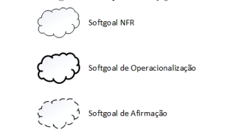
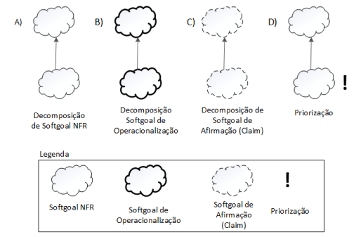
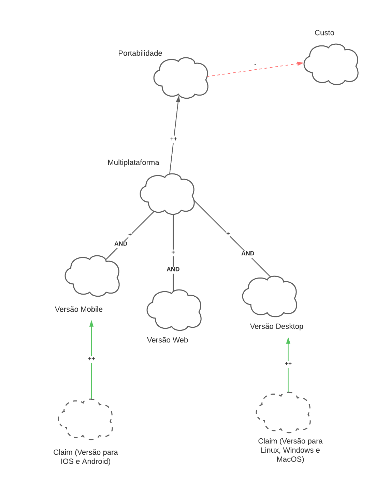
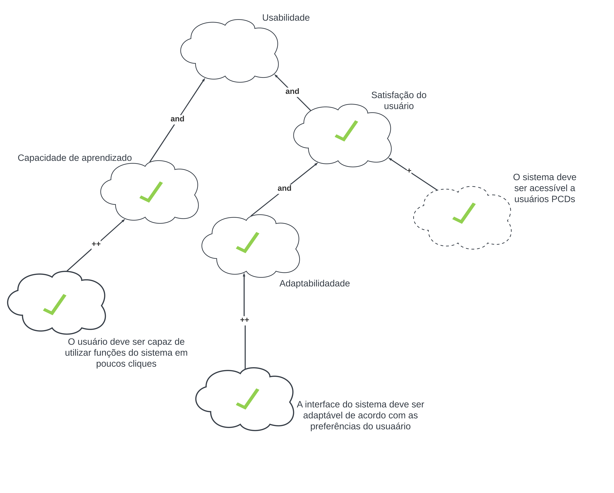

# NFR Framework

## Introdução

O NFR Framework é uma abordagem para representar e analisar Requisitos Não-Funcionais, com o objetivo de ajudar desenvolvedores na implementação de soluções personalizadas, levando em consideração as características do domínio e do sistema em questão. O Framework utiliza o conceito de softgoal, definido como um objetivo que não possui uma clara definição nem critérios de satisfação precisos. O funcionamento do Framework pode ser visualizado por meio de um gráfico de interdependência de softgoal (Softgoal Interdependency Graph (SIG)).

## Softgoal Interdependency Graph - SIG

É um gráfico registra as considerações do desenvolvedor sobre os softgoals e mostra suas interdependências. Trata-se de um gráfico que armazena um registro completo das decisões de desenvolvimento e da lógica do
projeto de forma gráfica e concisa.

## Softgoal

Os "softgoals" são utilizados para descrever Requisitos Não-Funcionais e podem estar conectados entre si, demonstrando como um "softgoal" influencia outro. Softgoals são divididos em três tipos e sua representação gráfica é apresentada na figura 1:

- NFR Softgoals: Representam os requisitos não funcionais;
- Softgoals de Operacionalização: soluções de implementação para satisfazer softgoals NFR, ou seja, representam basicamente funcionalidades;
- Softgoals de Afirmação: Escritos em linguagem natural e se tratam de registros adicionais e argumentativos que podem ser acrescentados ao modelo.

 

 Figura 1: – Tipos de Softgoals (Fonte: CHUNG et al., 2000)¹.

Os softgoals e suas interdependências são representados no SIG. As interdependências definem as relações entre os softgoals e os tipos de interdependências utilizadas pelo framework são os refinamentos e as contribuições. O refinamento é dividido em três tipos e sua representação gráfica é apresentada na figura 2:

- Decomposição de Softgoal NFR: refina ou subdivide um softgoal NFR em outros
específicos;
- Decomposição de Operacionalização: refina um softgoal de operacionalização em outros softgoals de operacionalização mais específicos;
- Decomposição de Afirmação (Claims): serve para apoiar ou negar justificativas específicas de projeto.
- Priorização:  refina um softgoal em outro softgoal com o mesmo tipo e tópicos, mas com uma prioridade associada.

 

 Figura 2: – Tipos de decomposições (Fonte: CHUNG et al., 2000)¹.

Os softgoals são refinados diversas vezes durante o ciclo de vida de um projeto, e nesses refinamentos um softgoal pode contribuir de forma total ou parcial, e de forma positiva ou negativa para o softgoal do qual ele derivou. As contribuições são divididas em diversos tipos:

- AND: Se os softgoals descendentes forem satisfeitos os softgoals ascendentes serão satisfeitos; 
- OR: Se algum softgoal descendente for satisfeito, o ascendente será satisfeito; 
- MAKE(++): Se o softgoal descendente for satisfeito o softgoal pai também será satisfeito;
- BREAK(- -): Se o softgoal descendente for suficientemente satisfeito o softgoal pai será negado, ou seja não será satisfeito;
- HELP(+):  Se o softgoal descendente for parcialmente satisfeito o softgoal ascendente será parcialmente satisfeito;
- HURT(-): Se o softgoal descendente for satisfeito o softgoal ascendente será parcialmente negado; 
- UNKNOWN(?): Contribuição desconhecida entre um softgoal descendente e um softgoal ascendente;
- EQUALS: relação direta entre as satisfações do softgoal ascendente e descendente;
- SOME: A contribuição é conhecida, mas a extensão (parcial ou total) não é.

A análise dos softgoals de nível mais baixo na hierarquia em um SIG se refere a decisões
sobre aceitar ou negar alternativas no projeto e essas decisões geram um conjunto inicial de
rótulos onde o procedimento de avaliação utiliza esses rótulos para determinar o impacto
das decisões nos softgoals que estão em um nível mais alto na hierarquia, isso é realizado
até chegar aos softgoals no nível mais alto do SIG². Os tipos de rótulos são apresentados na figura 3.

 

 Figura 3: – Tipos de rótulos utilizados pelos softgoals (Fonte: SILVA, 2019).

Descrição: 

- Satisfeito: Reflete que um requisito não funcional contribui de maneira positiva para a realização de outro requisito, resultando em satisfação.
- Fracamente satisfeito: indica uma relação de impacto positiva, mas menos forte do que a notação satisfeito.
- Negado: Demonstrando que um requisito não funcional afeta adversamente outro requisito, anulando ou contradizendo sua concretização.
- Fracamente negado: Similar à notação negado, mas com uma relação de negação mais fraca.
- Conflitante: Indica uma relação de conflito entre requisitos não funcionais. Isso implica que os requisitos possuem características tanto positivas quanto negativas.
- Indeterminado: Refere-se a uma relação incerta ou desconhecida entre requisitos não funcionais. Isso ocorre quando há informações insuficientes para determinar o impacto de um requisito em outro.

## Metodologia

Inicialmente, foram considerados os requisitos não funcionais previamente elicitados. Após uma análise aprofundada do NFR Framework, procedemos com uma introspecção para o desenvolvimento dos SIGs. As ferramentas utilizadas foram Paint e LucidChart.

## NFR

### NFR-01 - Portabilidade

A figura 4 representa o SIG de portabilidade.

Figura 4: SIG de portabilidade (Fonte:Adaptado de Figura 21 – Requisito de Confiabilidade - Refinamentos e Correlações por Reinaldo Antônio da Silva, 2023)

#### Propagação de impacto

A figura 5 apresenta a propagação de impacto do NFR de Portabilidade.

Figura 5: SIG de portabilidade com propagação de impactos (Fonte: Ana Luíza e Rafael Xavier, 2023)

#### Cartão de especificação

A tabela 1 apresenta o cartão de especificação do desempenho.

| Classificação         | Compatibilidade do aplicativo em diferentes sistemas operacionais e dispositivos / Portabilidade | 
| ----------------------|-------------------------------|
| Descrição             | O aplicativo deve ser compatível tanto com dispositivos mobile (Android ou IOS), desktops (Linux,Windowse MacOS) e com sistemas web |
| Justificativa         | Torna o aplicativo muito mais acessível e versátil.|
| Origem do requisito   | BS27 e INT21. Fonte: [Moscow](https://requisitos-de-software.github.io/2023.2-LibreOffice/elicitacao/priorizacao/moscow/) |
| Critério de aceitação | Nenhum |
| Prioridade            | Alta  |
| Conflito              | Nenhum |

Tabela 1: Cartão de especificação (Fonte: Ana Luíza e Rafael Xavier, 2023)

### NFR-02 - Desempenho

A figura 6 representa o SIG de desempenho.

Figura 6: SIG de desempenho (Fonte:Adaptado de Figura 21 – Requisito de Confiabilidade - Refinamentos e Correlações por Reinaldo Antônio da Silva, 2023)

#### Propagação de impacto

A figura 7 apresenta a propagação de impacto do NFR de desempenho.

Figura 7: SIG de desempenho com propagação de impactos (Fonte: Ana Luíza e Rafael Xavier, 2023)

#### Cartão de especificação

A tabela 2 apresenta o cartão de especificação do desempenho.

| Classificação         | Desempenho | 
| ----------------------|-------------------------------|
| Descrição             | O aplicativo deve ser eficiente em termos de consumo de recursos do sistema, como CPU e memória, para garantir um desempenho responsivo mesmo em sistemas menos poderosos ou em situações de documentos muito grandes |
| Justificativa         | O usuário precisa que o sistema responda corretamente para que qualquer tarefa do usuário que esteja sendo feita ão seja afetada negativamente por travamentos ou coisas parecidas.|
| Origem do requisito   | INT24 e BS25. Fonte: [Moscow](https://requisitos-de-software.github.io/2023.2-LibreOffice/elicitacao/priorizacao/moscow/) |
| Critério de aceitação | O sistema deve atender aos padrões de tempo de resposta e taxa de transferência definidos pelo cliente, medidos por ferramentas de monitoramento e avaliação de desempenho. |
| Prioridade            | Alta  |
| Conflito              | Nenhum |

Tabela 2: Cartão de especificação (Fonte: Ana Luíza e Rafael Xavier, 2023)

### NFR-03 - Usabilidade

A figura 7 representa o SIG de usabilidade.

Figura 7: SIG de desempenho (Fonte:Adaptado de Figura 61 – Requisito Usabilidade - Refinamentos e Correlações por Reinaldo Antônio da Silva, 2023)

#### Propagação de impacto

A figura 8 apresenta a propagação de impacto do NFR de usabilidade.

Figura 8: SIG de desempenho com propagação de impactos (Fonte: Ana Luíza e Rafael Xavier, 2023)

#### Cartão de especificação

A tabela 3 apresenta o cartão de especificação de usabilidade.

| Classificação         | Usabilidade | 
| ----------------------|-------------------------------|
| Descrição             | O aplicativo deve ser acessível para pessoas com deficiência seguindo diretrizes de acessibilidade para facilitar o uso por leitores de tela e outras tecnologias assistivas. A interface do sistema deve ser personalizável de acordo com as preferências do usuário  |
| Justificativa         | O usuário precisa que o sistema seja acessível e personalizável para garantir uma melhor usabilidade|
| Origem do requisito   | INT23 e INT28. Fonte: [Introspecção](../../elicitacao/introspeccao.md) |
| Critério de aceitação | O sistema deve garantir que o usuário consiga utilizar da maneira mais intuitiva e acessível possível. |
| Prioridade            | Alta  |
| Conflito              | Nenhum |

Tabela 3: Cartão de especificação (Fonte: Ana Luíza e Rafael Xavier, 2023)

## Bibliografia

>Repositório da disciplina: <https://requisitos-de-software.github.io/2023.1-Simplenote/modelagem/agil/nfr//>. Acesso em: 05/11/2023.

>Repositório da disciplina: <https://requisitos-de-software.github.io/2023.1-BilheteriaDigital/modelagem/agil/nfrframework/>. Acesso em: 05/11/2023.

>SERRANO, Milene. Requisitos – Aula 17. 2017. Apresentação de slides. Disponível em: <https://aprender3.unb.br/pluginfile.php/2692836/mod_resource/content/1/Requisitos%20-%20Aula%20019a.pdf>. Acesso em: 05/11/2023.

## Referência Bibliográfica

> <a id="REF1" href="#anchor_1">1.</a> SILVA, Reinaldo Antônio. NFR4ES: Um Catálogo de Requisitos Não-Funcionais para Sistemas Embarcados. Centro de Informática UFPE, Recife, 2019. Disponível em: https://repositorio.ufpe.br/handle/123456789/34150. Acesso em: 05/11/2023.

> <a id="REF1" href="#anchor_1">2.</a> CHUNG, L., NIXON, B. A., YU, E., MYLOPOULOS, J. Non-functional requirements in software engineering. Springer Science & Business Media: [S.l.], 2000. v. 5.

## Histórico de versão

| Versão  | Data       | Descrição                  | Autor                    | Revisor   |
|---------|------------|----------------------------|-------------|-----------|
| 1.0     | 05/11/2023 | Criação do documento | Ana Luíza e Rafael | Ana Letícia e Edilberto |

