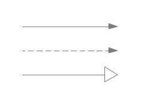
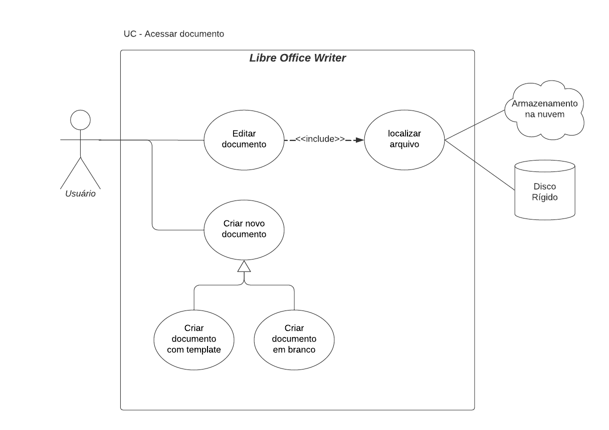
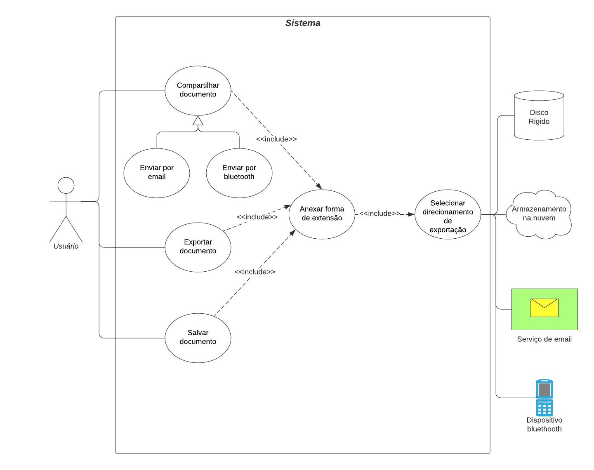
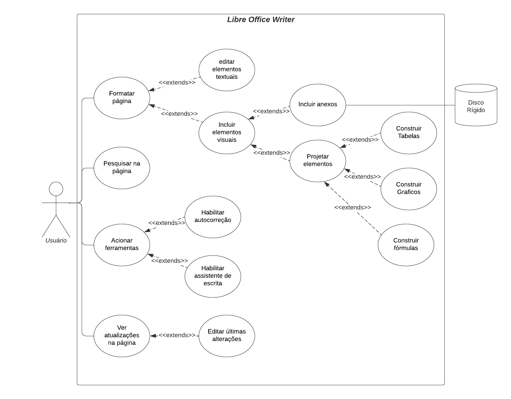

# Caso de Uso

## Introdução

Após a elicitação de requisitos a partir das técnicas desenvolvidas pela equipe, buscou-se analisar as funcionalidades levantadas e as interações entre os atores do sistema proposto. Nesse contexto, o artefato desenvolvido emprega a  metodologia de diagrama de casos de uso, dentro da notação notação UML (Unified Modeling Language), como uma abordagem eficaz para modelar os diferentes cenários de uso de um sistema.

## Metodologia

Na Linguagem de Modelagem Unificada (UML), o diagrama de casos de uso efetua a modelagem simplificada das interações (casos de uso) entre os atores e um sistema em desenvolvimento. Sendo responsável por descrever os diferentes cenários de uso de uma aplicação, além de identificar as funcionalidades fornecidas e sua utilização dada pelos atores no ambiente.

A construção de um diagrama pode ser definida por 4 elementos fundamentais para a elaboração e entendimento das funcionalidades e interações no sistema, sendo representados na Tabela 1 subsequente.

| Nome | Função | Elemento
|------|------|:-------:
| Ator | Representam um componente externo que interage com os objetos dentro do sistema. Ele pode ser identificado por um usuário, sistema ou outro elemento externo no cenário da aplicação. | <figure style="width: 20%; display: flex;"></figure>
| Elipse (Caso de Uso) | Descreve uma ação ou funcionalidade específica que um ator pode realizar dentro do sistema. | <figure style="width: 40%; display: flex;"></figure>
| Retângulo (Sistema) | Descreve o sistema proposto, sendo composto por casos de uso e relações no seu cenário interno e atores no seu cenário externo. | <figure style="width: 40%; display: flex;"></figure>
| Flecha (Relações) | Representam as relações e interações entre os atores e casos de uso | <figure style="width: 40%; display: flex;"></figure>

 Tabela 1: Elementos do diagrama de casos de uso (Fonte: Artur Seppa Reiman, 2023).

Nesse contexto, para destacar uma melhor percepção do sistema, as tabelas 2 e 3 buscam representar, a definição das relações assim como as possíveis definições de atores.

|Relação|Descrição
|:--:|:--:|
| include | Indica uma relação entre casos de usos dependentes, no qual o elemento antecessor necessita da execução subsequente do seu sucessor no sistema. |
| extends | Indica uma relação entre casos de usos independentes, no qual o elemento antecessor pode executar ou não o elemento sucessor no sistema. |

 Tabela 2: Definição das relações nos casos de uso (Fonte: Artur Seppa Reiman, 2023).

|Ator|Descrição
|:--:|:--:|
| primário | Representa os atores que executam as funcionalidades no sistema, sendo alocados ao lado esquerdo do retângulo |
| secundário | Representa os atores que respondem a alguma funcionalidade executada no sistema, sendo alocados ao lado esquerdo do retângulo |

 Tabela 3: Definição dos atores primários e secundários (Fonte: Artur Seppa Reiman, 2023).

 
## Diagrama de Caso de Uso

A construção dos Diagramas de Casos de Uso desenvolvidos e representados nas figuras 1, 2 e 3 e tabelas de 4 a 9, foram elaborados a partir da ferramenta de modelagem Lucichard e seguem como base os requisitos elicitados na seção anterior do projeto.

### UC-Acessar Documento
|                                                    |
|---------------------------------------------------------------------------------------|

 Figura 1: Diagrama de Casos de Uso referentes ao acesso de documentos (Fonte: Artur Seppa Reiman, 2023).

### Caso de Uso 1 - Criar novo documento

| UC01 | Informações |
| ----- | ---------- |
| Descrição | O usuário é capaz de criar novos documentos no sistema |
| Ator | Usuário |
| Pré-condições | Acesso a aplicação |
| Ação | O usuário determina a instanciação de documentos dentre as possíveis formas |
| Fluxo principal | <ol> <li> O usuário acessa o aplicativo <li> O usuário acessa o menu de documentos em "Arquivos" e a aba "Novo" <li> O usuário indica se o documento a ser produzido será um arquivo em branco ou a partir de um template pré definido </ol> |
| Fluxo alternativo | <ol> <li> O Usuário acessa a aplicação <li> O sistema inicia com a instanciação de um arquivo em branco pronto para ser redigido </ol> |
| Fluxo de exceção | <ol> <li> O usuário acessa o aplicativo <li> O aplicativo exibe uma mensagem de erro informando que não foi possível carregar um novo documento |
| Pós-condições | O usuário tem acesso a um novo documento para ser redigido |
| Data de Criação | 22/10/2023 |
| Rastreabilidade | [BS01](https://requisitos-de-software.github.io/2023.2-LibreOffice/elicitacao/tecnicas/brainstorming/), [INT01](https://requisitos-de-software.github.io/2023.2-LibreOffice/elicitacao/introspeccao/), [BS19](https://requisitos-de-software.github.io/2023.2-LibreOffice/elicitacao/introspeccao/)

 Tabela 4: UC 1 - Criar novo documento (Fonte: Artur Seppa Reiman, 2023).

### Caso de Uso 2 - Editar documento

| UC02 | Informações |
| ----- | ---------- |
| Descrição | O usuário é capaz de editar documentos no sistema |
| Ator | Usuário |
| Pré-condições | Acesso a aplicação e acesso aos dispositivos de armazenamento |
| Ação | O usuário determina a edição de documentos |
| Fluxo principal | <ol> <li> O usuário acessa o aplicativo <li> O usuário acessa o menu de documentos em "Arquivos" e a aba "Abrir ..." <li> O usuário localiza o documento a ser editado seja no disco rigido ou na nuvem </ol> |
| Fluxo alternativo | <ol> <li> O Usuário acessa as formas de armazenamento do sistema <li> O usuário abre o arquivo com a aplicação </ol> |
| Fluxo de exceção | <ol> <li> O usuário acessa o aplicativo <li> O usuário localiza e solicita a abertura do documento no sistema <li> O aplicativo exibe uma mensagem de erro informando que não foi possível carregar o documento |
| Pós-condições | O usuário pode editar um documento na aplicação |
| Data de Criação | 22/10/2023 |
| Rastreabilidade | [BS02](https://requisitos-de-software.github.io/2023.2-LibreOffice/elicitacao/tecnicas/brainstorming/), [BS21](https://requisitos-de-software.github.io/2023.2-LibreOffice/elicitacao/tecnicas/brainstorming/), [BS15](https://requisitos-de-software.github.io/2023.2-LibreOffice/elicitacao/tecnicas/brainstorming/), [INT13](https://requisitos-de-software.github.io/2023.2-LibreOffice/elicitacao/introspeccao/)

 Tabela 5: UC 2 - Editar documento (Fonte: Artur Seppa Reiman, 2023).

### UC-Transferência de dados
|                                                    |
|---------------------------------------------------------------------------------------|

 Figura 2: Diagrama de Casos de Uso referentes a transferência de dados (Fonte: Artur Seppa Reiman, 2023).

### Caso de Uso 3 - Compartilhar documento

| UC03 | Informações |
| ----- | ---------- |
| Descrição | O usuário é capaz de compartilhar documentos de diferentes formas |
| Ator | Usuário |
| Pré-condições | Acesso a aplicação e acesso aos dispositivos de compartilhamento |
| Ação | O usuário determina o compartilhamento de arquivos dentre as duas possíveis formas |
| Fluxo principal | <ol> <li> O usuário acessa o aplicativo e o documento a ser compartilhado <li> O usuário acessa o menu de documentos em "Arquivos" e a aba "Enviar" <li> O usuário indica se o documento pode ser compatilhado via email ou bluetooth  <li> O usuário determina a forma de exportação a partir das extensões disponíveis   |
| Fluxo alternativo | Não há fluxo alternativo |
| Fluxo de exceção | <b>Fluxo 1: Compartilhar via Email</b> <ol> <li> O usuário acessa o aplicativo e o documento a ser compartilhado <li> O usuário acessa o menu de documentos em "Arquivos" e a aba "Enviar" <li> O usuário indica que o documento vai ser compatilhado via email <li> O sistema indicar que não foi possível acessar o serviço de email </ol> <b> Fluxo 2: Compartilhar via Bluetooth</b> <ol> <li> O usuário acessa o aplicativo e o documento a ser compartilhado <li> O usuário acessa o menu de documentos em "Arquivos" e a aba "Enviar" <li> O usuário indica que o documento vai ser compatilhado via bluetooth <li> O sistema notificar que nenhum dispositivo bluetooth foi encontrado para enviar o arquivo </ol> |
| Pós-condições | O usuário compartilha o documento definido |
| Data de Criação | 22/10/2023 |
| Rastreabilidade | [BS15](https://requisitos-de-software.github.io/2023.2-LibreOffice/elicitacao/tecnicas/brainstorming/), [INT14](https://requisitos-de-software.github.io/2023.2-LibreOffice/elicitacao/introspeccao/), [BS03](https://requisitos-de-software.github.io/2023.2-LibreOffice/elicitacao/introspeccao/), [BS03](https://requisitos-de-software.github.io/2023.2-LibreOffice/elicitacao/tecnicas/brainstorming/)

 Tabela 6: UC 3 - Compartilhar documento (Fonte: Artur Seppa Reiman, 2023).

### Caso de Uso 4 - Exportar documento

| UC04 | Informações |
| ----- | ---------- |
| Descrição | O usuário é capaz de exportar documentos com diferentes tipos de extensões de arquivo dentro do sistema |
| Ator | Usuário |
| Pré-condições | Acesso a aplicação e acesso aos dispositivos de armazenamento |
| Ação | O usuário determina o tipo de extensão e o local de armazenamento do arquivo a ser exportado |
| Fluxo principal | <ol> <li> O usuário acessa o aplicativo e o documento a ser exportado <li> O usuário acessa o menu de documentos em "Arquivos" e a aba "Exportar como" <li> O usuário indica a extensão de exportação do documento  <li> O usuário determina o direcionamento de armazenamento do arquivo |
| Fluxo alternativo | Não há fluxo alternativo |
| Fluxo de exceção | <b>Fluxo 1: Exportação para o Disco Rígido</b> <ol> <li> O usuário acessa o aplicativo e o documento a ser exportado<li> O usuário acessa a aba "Exportar como" <li> O usuário indica a extensão de exportação do documento  <li> O usuário determina que o direcionamento de armazenamento do arquivo será no disco rígido <li> O sistema notificar que não espaço suficiente no sistema para armazenar o arquivo no disco </ol> <b> Fluxo 2: Exportação para a Nuvem </b> <ol> <li> O usuário acessa o aplicativo e o documento a ser exportado<li> O usuário acessa a aba "Exportar como" <li> O usuário indica a extensão de exportação do documento  <li> O usuário determina que o direcionamento de armazenamento do arquivo será na nuvem <li> O sistema notificar que não conseguiu obter acesso ao armazenamento na nuvem no sistema </ol> |
| Pós-condições | O usuário compartilha o documento definido |
| Data de Criação | 22/10/2023 |
| Rastreabilidade | [INT14](https://requisitos-de-software.github.io/2023.2-LibreOffice/elicitacao/introspeccao/), [BS03](https://requisitos-de-software.github.io/2023.2-LibreOffice/elicitacao/introspeccao/), [BS03](https://requisitos-de-software.github.io/2023.2-LibreOffice/elicitacao/tecnicas/brainstorming/)

 Tabela 7: UC 4 - Exportar documento (Fonte: Artur Seppa Reiman, 2023).

### Caso de Uso 5 - Salvar documento

| UC05 | Informações |
| ----- | ---------- |
| Descrição | O usuário é capaz de salvar documentos na extensão padrão odt dentro do sistema |
| Ator | Usuário |
| Pré-condições | Acesso a aplicação e acesso aos dispositivos de armazenamento |
| Ação | O usuário determina o local de armazenamento do arquivo com a sua extensão odt |
| Fluxo principal | <ol> <li> O usuário acessa o aplicativo e o documento a ser armazenado <li> O usuário acessa o menu de documentos em "Arquivos" e a aba "Salvar" <li> O usuário indica se o documento odt pode ser armazenado no disco rigido do dispositivo do sistema ou na nuvem |
| Fluxo alternativo | <ol> <li> O usuário acessa o aplicativo e o documento a ser armazenado <li> O usuário pressiona as teclas "Ctrl+S" <li> O usuário indica o local de armazenamento do arquivo no sistema |
| Fluxo de exceção | <b>Fluxo 1: Armazenamento em Disco Rígido</b> <ol> <li> O usuário acessa o aplicativo e o documento a ser armazenado <li> O usuário acessa o menu de documentos em "Arquivos" e a aba "Salvar" <li> O usuário indica que o documento odt vai ser armazenado no disco rigido do dispositivo <li> O sistema notificar que não espaço suficiente no sistema para armazenar o arquivo no disco </ol> <b> Fluxo 2: Armazenamento na Nuvem </b> <ol> <li> O usuário acessa o aplicativo e o documento a ser armazenado <li> O usuário acessa o menu de documentos em "Arquivos" e a aba "Salvar" <li> O usuário indica que o documento odt vai ser armazenado na nuvem <li> O sistema notificar que não conseguiu obter acesso ao armazenamento na nuvem no sistema </ol> |
| Pós-condições | O usuário salva o documento no sistema |
| Data de Criação | 22/10/2023 |
| Rastreabilidade | [INT14](https://requisitos-de-software.github.io/2023.2-LibreOffice/elicitacao/introspeccao/), [BS03](https://requisitos-de-software.github.io/2023.2-LibreOffice/elicitacao/introspeccao/), [BS03](https://requisitos-de-software.github.io/2023.2-LibreOffice/elicitacao/tecnicas/brainstorming/)

 Tabela 8: UC 5 - Salvar documento (Fonte: Artur Seppa Reiman, 2023).

### UC-Redigir documento
|                                                    |
|---------------------------------------------------------------------------------------|

 Figura 3: Diagrama de Casos de Uso referentes a produção de documento (Fonte: Artur Seppa Reiman, 2023).

### Caso de Uso 6 - Formatar página

| UC06 | Informações |
| ----- | ---------- |
| Descrição | O usuário é capaz de formatar as páginas do documento e acessar a ajuda de formatação |
| Ator | Usuário |
| Pré-condições | Acesso a aplicação e acesso ao dispositivo de armazenamento |
| Ação | O usuário impõe a edição de elementos textuais e visuais no documento. Além de ter acesso a ajuda |
| Fluxo principal | <ol> <li> O usuário acessa o aplicativo e o documento a ser formatado <li> O usuário acessa o menu de formatação em "Inserir", "Formatar" e "Estilos" <li> O usuário indica as operações de formatação que deseja executar <li> A depender o usuário impõe os elementos textuais e visuais, formatando o texto, anexando aquivos, construindo gráficos, tabelas e fórmulas. Além de obter ajuda de formatação </ol> |
| Fluxo alternativo |  <ol> <li> O usuário acessa o aplicativo e o documento a ser formatado <li> O usuário acessa a barra inicial superior <li> O usuário indica as formatações que deseja realizar, clicando nos icones correspondentes para editar </ol> |
| Fluxo de exceção | <ol> <li> O usuário acessa o aplicativo e o documento a ser formatado <li> O usuário busca utilizar as ferramentas de alteração de elementos visuais e textuais  <li> O sistema indicar que não foi possível acessar essas ferramentas </ol> |
| Pós-condições | O usuário formata o documento de acordo com seu interesse |
| Data de Criação | 22/10/2023 |
| Rastreabilidade | [BS05](https://requisitos-de-software.github.io/2023.2-LibreOffice/elicitacao/tecnicas/brainstorming/), [BS06](https://requisitos-de-software.github.io/2023.2-LibreOffice/elicitacao/tecnicas/brainstorming/), [BS07](https://requisitos-de-software.github.io/2023.2-LibreOffice/elicitacao/tecnicas/brainstorming/), [INT02](https://requisitos-de-software.github.io/2023.2-LibreOffice/elicitacao/introspeccao/), [INT03](https://requisitos-de-software.github.io/2023.2-LibreOffice/elicitacao/introspeccao/), [INT04](https://requisitos-de-software.github.io/2023.2-LibreOffice/elicitacao/introspeccao/), [INT05](https://requisitos-de-software.github.io/2023.2-LibreOffice/elicitacao/introspeccao/), [INT06](https://requisitos-de-software.github.io/2023.2-LibreOffice/elicitacao/introspeccao/), [INT07](https://requisitos-de-software.github.io/2023.2-LibreOffice/elicitacao/introspeccao/), [INT08](https://requisitos-de-software.github.io/2023.2-LibreOffice/elicitacao/introspeccao/), [INT09](https://requisitos-de-software.github.io/2023.2-LibreOffice/elicitacao/introspeccao/)

 Tabela 9: UC 6 - Formatar página (Fonte: Artur Seppa Reiman, 2023).

### Caso de Uso 7 - Pesquisar na página

| UC07 | Informações |
| ----- | ---------- |
| Descrição | O usuário é capaz de pesquisar palavras e textos de interesse no documento |
| Ator | Usuário |
| Pré-condições | Acesso a aplicação |
| Ação | O usuário impõe a pesquisa de palavras e textos no documento |
| Fluxo principal | <ol> <li> O usuário acessa o aplicativo e o documento de interesse <li> O usuário acessa o menu de "Editar" e a aba "Localizar" <li> O usuário insere o texto a ser buscado no documento </ol> |
| Fluxo alternativo |  <ol> <li> O usuário acessa o aplicativo e o documento de interesse <li> O usuário insere o atalho de busca "Ctrl+F" <li> O usuário indica o texto a ser localizado </ol> |
| Fluxo de exceção | <ol> <li> O usuário acessa o aplicativo e o documento de interesse <li> O usuário buscar o texto no documento <li> A aplicação notifica o usuário que a ferramenta não está operando da forma correta </ol> |
| Pós-condições | O usuário localiza o texto de interesse no documento |
| Data de Criação | 22/10/2023 |
| Rastreabilidade | [BS20](https://requisitos-de-software.github.io/2023.2-LibreOffice/elicitacao/tecnicas/brainstorming/), [INT11](https://requisitos-de-software.github.io/2023.2-LibreOffice/elicitacao/introspeccao/)

 Tabela 10: UC 7 - Pesquisar na página (Fonte: Artur Seppa Reiman, 2023).

### Caso de Uso 8 - Acionar ferramentas

| UC08 | Informações |
| ----- | ---------- |
| Descrição | O usuário é capaz de acionar as ferramentas de auxilio de escrita no documento |
| Ator | Usuário |
| Pré-condições | Acesso a aplicação |
| Ação | O usuário aciona as ferramentas de auxilio de escrita no sistema |
| Fluxo principal | <ol> <li> O usuário acessa o aplicativo e o documento de interesse <li> O usuário acessa o menu de "Ferramentas" e suas configurações <li> O usuário aciona a autocorreção e/ou o assistente de escrita </ol> |
| Fluxo alternativo | não há fluxo alternativo |
| Fluxo de exceção | <ol> <li> O usuário acessa o aplicativo e o documento de interesse <li> O usuário busca acionar alguma ferramenta <li> A aplicação notifica o usuário que a ferramenta não está operando da forma correta </ol> |
| Pós-condições | O usuário aciona ferramentas de escrita no documento |
| Data de Criação | 22/10/2023 |
| Rastreabilidade | [BS04](https://requisitos-de-software.github.io/2023.2-LibreOffice/elicitacao/tecnicas/brainstorming/), [BS18](https://requisitos-de-software.github.io/2023.2-LibreOffice/elicitacao/tecnicas/brainstorming/), [BS14](https://requisitos-de-software.github.io/2023.2-LibreOffice/elicitacao/tecnicas/brainstorming/), [BS16](https://requisitos-de-software.github.io/2023.2-LibreOffice/elicitacao/tecnicas/brainstorming/),  [INT10](https://requisitos-de-software.github.io/2023.2-LibreOffice/elicitacao/introspeccao/)

 Tabela 11: UC 8 - Acionar ferramentas (Fonte: Artur Seppa Reiman, 2023).

### Caso de Uso 9 - Ver atualizações na página

| UC09 | Informações |
| ----- | ---------- |
| Descrição | O usuário é capaz de ver as atualizações no documento |
| Ator | Usuário |
| Pré-condições | Acesso a aplicação |
| Ação | O usuário verifica as atualizações do documento no sistema |
| Fluxo principal | <ol> <li> O usuário acessa o aplicativo e o documento de interesse <li> O usuário acessa o menu de "Editar" e a aba de "Registrar alterações" <li> Verifica e edita as últimas atualizações feitas no sistema </ol> |
| Fluxo alternativo | não há fluxo alternativo |
| Fluxo de exceção | <ol> <li> O usuário acessa o aplicativo e o documento de interesse <li> O usuário busca verificar e editar alguma atualizações no documento <li> A aplicação notifica o usuário que a ferramenta não está operando da forma correta </ol> |
| Pós-condições | O usuário verifica e editar as atualizações feitas no sistema |
| Data de Criação | 22/10/2023 |
| Rastreabilidade | [INT18](https://requisitos-de-software.github.io/2023.2-LibreOffice/elicitacao/introspeccao/)

 Tabela 12: UC 9 - Ver atualizações na página (Fonte: Artur Seppa Reiman, 2023).

## Bibliografia 

>FERNANDO, Sidney. Caso de Uso. Repositório da disciplina de Requisitos de Software da Universidade de Brasília, 2023. Disponível em: https://requisitos-de-software.github.io/2023.1-BilheteriaDigital/modelagem/useCase/. Acesso em: 20 outubro 2023.

>Tutorial de Caso de Uso UML. Disponível em: <https://www.youtube.com/watch?v=ab6eDdwS3rA>. Acesso em: 20 outubro 2023.

>Lucidchart. Diagrama de Caso de Uso UML. Disponível em: <https://www.lucidchart.com/pages/pt/diagrama-de-caso-de-uso-uml>.  Acesso em: 20 outubro 2023.

>UML DIAGRAMS. Use Case Diagrams. Disponível em: <https://www.uml-diagrams.org/use-case-diagrams.html>. Acesso em: 20 outubro 2023.

## Histórico de Versões

| Versão | Data         | Descrição                                              | Autor             | Revisor     |
|--------|--------------|--------------------------------------------------------|-------------------|-------------|
| 1.0    | 22/10/2023   | Criação da Página e Incorporação dos seus elementos | Artur Seppa   |   Ana Luíza    |