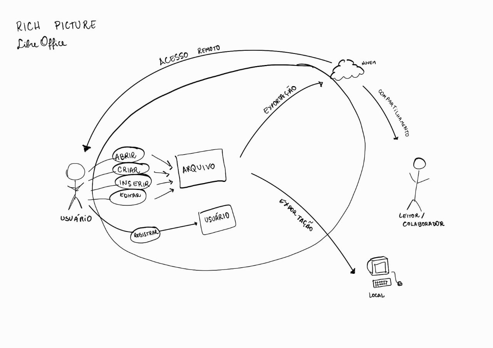
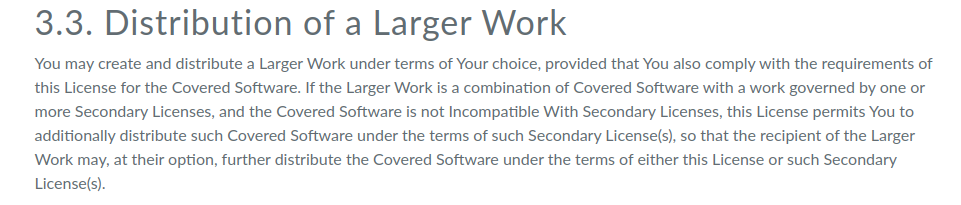

## Introdução

O aplicativo escolhido foi o Libre Office Writer. Os integrantes da equipe decidiram em consenso na reunião do dia [14/09/2023](../atas/ata_14_09.md). Neste documento será apresentado o motivo da escolha, os critérios para escolha e o termo de uso.

## Critérios para escolha

- Aplicativo não ter sido trabalhado na disciplina;
- Facilidade de contato com o público-alvo;
- Complexidade do aplicativo;
- Disponibilidade de informações;
- Open Source;

## Motivações para a escolha

Baseado nos critérios citados anteriormente e após instrução do professor, o grupo decidiu por escolher o Libre Office Writer por alguns motivos. 

- O público alvo é amplo e de fácil acesso. O aplicativo apresenta funcionalidades que são utilizadas por diversos grupos de pessoas;

- O aplicativo é open source então não haveria dificuldade ou restrições para utilizá-lo na disciplina;

- O aplicativo não tem uma complexidade muito grande, mas ainda assim possui muitas funcionalidades que podem ser exploradas no decorrer da disciplina.

## Rich Picture

O Rich Picture é uma ferramenta visual para expressar ideias e analisar problemas, tudo isso de forma informal e de fácil entendimento. No contexto da engenharia de software, ele é utilizado para abstrair o funcionamento de sistemas de software e se apresenta na forma de um diagrama com alguns elementos básicos como: atores, processos, armazenamento de dados, setas e limites do sistema. 1

A figura 1 apresenta o Rich Picture do aplicativo Libre Office Writer

    
 Figura 1: Rich Picture (Fonte: Ana Leticia e Raphaela. 2023).

## Termos de uso

A fim de realizar o trabalho dentro das normas legais, o grupo verificou os [termos de uso](https://www.libreoffice.org/download/license/) do Libre Office Writer para garantir que possuíamos permissão explícita para realizar a análise durante o tempo da disciplina. A figura 1 mostra uma parte da licença que garante que não há restrições para a utilização do app na disciplina.

A licença deixa explícito que: 

"O LibreOffice é Software livre. Dado sua origem no OpenOffice.org, o LibreOffice é licenciado sob a licença LGPLv3 (a menos de onde for indicado), oferecendo liberdades e responsabilidades essenciais.

O LibreOffice está licenciado sob os termos da LGPLv3 (ou posteriores) e pela MPL - Mozilla Public License (ou posteriores). Significa que você está livre para usá-lo para fins pessoais e comerciais, que você está livre para copiar e distribuir o software, e que você está livre para modificar e reestruturar o código-fonte e criar obras derivadas."

Figura 1: Termo de Uso do Libre Office Writer. (Fonte: Ana Luíza, 2023) 

## Histórico de Versão

| Versão  | Data       | Descrição                  | Autor                    | Revisor   |
|---------|------------|----------------------------|-------------|-----------|
| 1.0     | 20/09/20233 | Criação do documento | Ana Luíza | Rafael |
| 1.1     | 06/12/20233 | Adicionando licença | Ana Luíza | Rafael |
