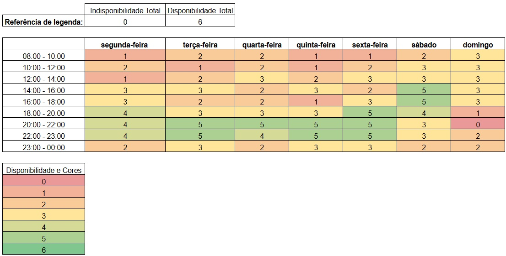

# Heatmap

O heatmap da _Figura 1_ tem por objetivo transparecer os horários livres dos membros da equipe, dessa forma é possível organizar e documentar os melhores dias e horários para a realização de reuniões.

|  |
|---------------------------------------------------|
| Figura 1: HeatMap; Fonte: autoria própria.        |

## Histórico de Versões

| Versão | Data       | Descrição                   | Autor             | Revisor         |
|--------|------------|-----------------------------|-------------------|-----------------|
| 1.0    | 19/09/2023|Criação da página|Edilberto Cantuaria   | Artur Seppa| 