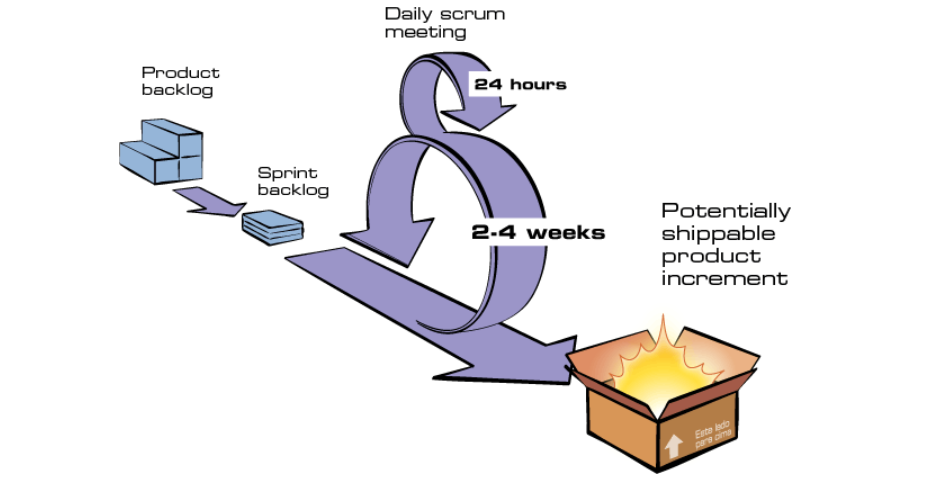

# Metodologia

Considerando o escopo do trabalho, é evidente que há um foco significativo na engenharia de requisitos. Nesse contexto, bem como na valorização da documentação gerada ao longo do projeto, identificamos uma conexão com abordagens de desenvolvimento orientadas ao plano. Conforme Sommerville (2011, p. 42) destaca, as saídas de um estágio são utilizadas como base para o planejamento da atividade no estágio subsequente. É importante ressaltar que essa abordagem não exclui a possibilidade de incorporar elementos das metodologias ágeis, pois, como mencionado por Sommerville (2011, p. 42), a maioria dos projetos de software combina práticas das abordagens orientadas ao plano e ágeis. Diante desse cenário, a equipe de desenvolvimento optou por adotar determinadas metodologias de modo a otimizar a organização e o processo de desenvolvimento, visando a máxima eficiência, considerando a realidade do grupo.

## 1. Scrum 

O Scrum é o principal framework utilizado para o desenvolvimento ágil de software e é utilizado para organizar e gerenciar projetos utilizando os valores e princípios do manifesto ágil em conjunto com um fluxo e os elementos definidos pelo framework. 

A imagem a seguir mostra o fluxo do Scrum.
### Fluxo do Scrum

<figcaption align="center">Figura 1: Fluxo do Scrum (Fonte: <a href="https://metodologiaagil.com/scrum/" target="_blanck">Metodologias Ágeis e Scrum</a>, 2022)</figcaption>

### Glossário:
- **_Issue_**:  termo geralmente utilizado em sistemas de rastreamento de problemas ou projetos para descrever uma tarefa, problema, melhoria ou trabalho a ser realizado no contexto de um projeto;
- **Product backlog**:  lista priorizada de funcionalidades e requisitos do projeto, criada e gerenciada pelo Product Owner;
- **Product Owner**: responsável por representar os interesses dos stakeholders e definir as prioridades do produto. Ele toma decisões sobre o que deve ser desenvolvido, mantendo o foco na entrega de valor aos clientes;
- **Stakeholders**: partes interessadas no projeto, como clientes, usuários e equipes envolvidas, que têm interesse no resultado do trabalho;
- **Sprint backlog**: conjunto de itens do Product Backlog selecionados para serem trabalhados durante uma Sprint, com base na prioridade e capacidade da equipe;
- **Daily scrum meeting**: reunião diária de curta duração, na qual a equipe compartilha o progresso, discute obstáculos e planeja as atividades do dia;
- **Potentially shippable product increment**: versão do produto que pode ser entregue ao cliente após cada Sprint, contendo funcionalidades totalmente desenvolvidas e testadas;
- **Sprint**: período de tempo fixo (geralmente de 2 a 4 semanas) durante o qual a equipe trabalha para entregar um conjunto específico de funcionalidades do Product Backlog;
- **24 hours**: 24 horas;
- **2-4 weeks**: 2-4 semanas;

### 1.1 Scrum Adaptado
Com o objetivo de garantir entregas consistentes e ágeis, optou-se por adaptar a metodologia ágil SCRUM para gerenciar o tempo da equipe, com período de sprints uma ou duas semanas, flexível de acordo com as demandas e prazos. 
#### Sprints
As sprints serão planejadas de acordo com os marcos estabelecidos no plano de ensino, com cada backlog de sprint representando a entrega a ser realizada no próximo marco de controle.

#### Reuniões Semanais
Com o auxílio do [heatmap](heatmap.md) decidiu-se que haverão duas reuniões: 
* a primeira às quartas-feiras às 20:00 com finalidade de revisar a sprint e a gravação da apresentação da entrega do ponto de controle (_sprint review_).
* a segunda às sextas-feiras às 18:00 com o objetivo de organizar as tarefas da sprint (_sprint planning_).

#### Revisão por pares
Para evitar erros na entrega e assegurar que toda a equipe esteja plenamente informada e concorde com as alterações feitas no trabalho, foi decidido que os artefatos produzidos devem ser revisados por outra pessoa ou por uma dupla que não tenha participado na criação do artefato, com o intuito de identificar possíveis falhas no mesmo. Para atividades com maior importância, há a revisão em grupo para que todos os integrantes tenham conhecimento e grantir que toda a equipe tenham conhecimento do andamento do projeto.

#### Comunicação
São ferramentas adotadas para a comunicação ao longo do projeto:
* Formal:Microsoft Teams e o GitHub
* Informal: Whatsapp.

## 2. Políticas

### Política de _commits_

As mensagens dos _commits_ seguirão os padrões estabelecidos pelo [Conventional Commits](https://www.conventionalcommits.org/en/v1.0.0/). Dessa forma, devem estar de acordo com o seguinte padrão:

```bash
git commit -m "tipoDeMudança(): descrição significativa da alteração #Numero_issue"
```

> Exemplo:
>
> O _commit_ referente a criação do arquivo `metodologias.md` pode ter a mensagem `docs: criação do documento de padrões e metodologias #37`

</br>

### Política de _branchs_  

As criações das _branchs_ devem seguir o padrão:

> Número da _issue_ associada + 
> Nome do documento
> 
>
> Exemplo:
> 
> A _issue_ 04 está associada à criação do arquivo `metodologia.md`. A _branch_ referente a correção do arquivo `metodologias.md` o seu nome deverá ser:
 
 `04-metodologia`
 
> e linkada a issue

</br>


## Referências
> Site metodologias ágeis - <a href="https://www.metodologiaagil.com">www.metodologiaagil.com</a>

>Sommerville,Ian - Engenharia de Software - 9 ed. - São Paulo: Pearson Prentice Hall, 2011.

## Histórico de Versões

| Versão  | Data       | Descrição                  | Autor                    | Revisor   |
|---------|------------|----------------------------|--------------------------|-----------|
| 1.0     | 19/09/20233 | Criação e edição da página | [Edilberto Cantuaria](https://github.com/edilbertocantuaria)        | [Ana Luíza](https://github.com/analuizargds) |
