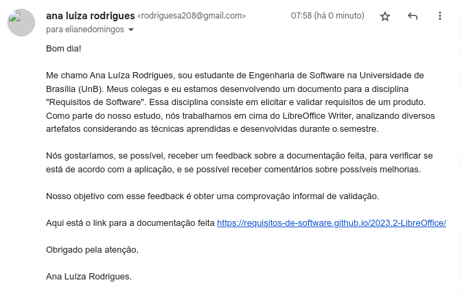

# Comprovação Informal

## Introdução

A norma internacional ISO/IEC/IEEE 12207:2017(E) (ISO/IEC/IEEE, 2017, p. 89, tradução nossa), define a finalidade do processo de validação como: “[...] fornecer evidência objetiva de que o sistema, quando em uso, cumpre seus objetivos de negócio ou de missão e os requisitos dos stakeholders, alcançando seu uso pretendido
no seu ambiente operacional pretendido”. A mesma norma complementa que “[...] esse processo provê as informações necessárias para que as anomalias identificadas possam ser resolvidas pelos processos técnicos apropriados onde essa anomalia foi criada” (ISO/IEC/IEEE, 2017, p. 89, tradução nossa) <a href="#REF1">[1]</a>. Pensando nisso, após o desenvolvimento da documentação fomos atrás de obter uma validação informal.

## Metodologia

Por meio da comprovação informal, que consiste em uma tarefa de leitura de descrições em linguagem natural e uso dos clientes para identificar problemas na expressão dos requisitos, ou seja, identificar erros, omissões e conflitos por parte de quem criou a documentação ou artefato. Na Figura 1, está contido a tentativa de contato com o uma pessoa da equipe do LibreOffice Writer para realizar dessa validação.

## Comprovação Informal

 Figura 1: Email para obter comprovação informal do LibreOffice Writer (Fonte: Ana Luíza, 2023). 

## Retorno

Até o momento da entrega do artefato não foram obtidas respostas de validação. Caso a equipe entre em contato antes do fim do semestre, será inserido neste artefato sua comprovação informal quanto ao que foi desenvolvido no projeto.

## Referência bibliográfica

> 
[1] REINEHR, Sheila. Engenharia de Requisitos. Porto Alegre: SAGAH, p. 253, 2020. 

## Histórico de versão

| Versão | Data       | Descrição                                             | Autor               | Revisor     |
| ------ | ---------- | ----------------------------------------------------- | ------------------- | ----------- |
| 1.0    | 04/12/2023 | Criação do documento | Ana Luíza | Edilberto |