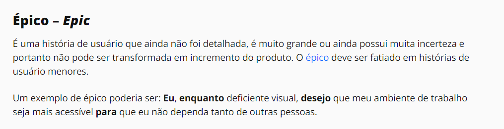
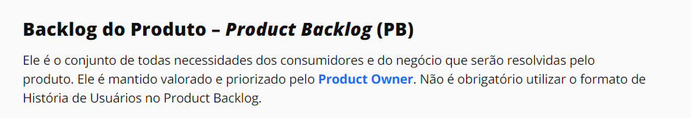
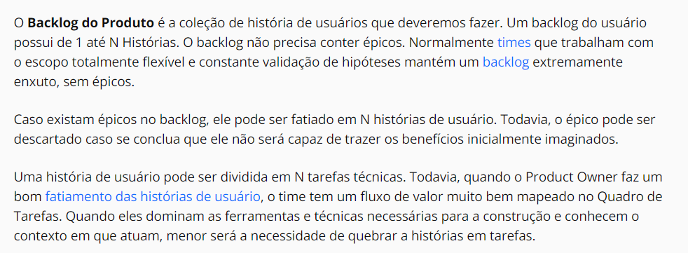
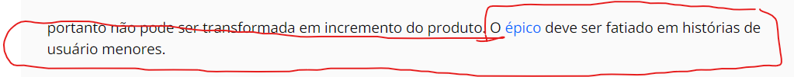
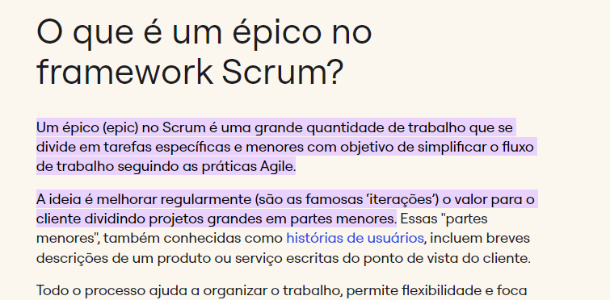

# Verificação Backlog

## Introdução

O presente documento apresentará a verificação do artefato [Backlog](https://requisitos-de-software.github.io/2023.2-LibreOffice/modelagem/agil/backlog/), desenvolvido pela equipe. A técnica de inspeção será aplicada para verificar esse artefato, de acordo com o planejamento estabelecido. Na tabela 1, se encontram os metadados desse artefato, nas tabelas 2 e 3 se encontram as questões a serem avaliadas e no Gráfico 1, o quanto das exigências foram atendidas.

<center>

| Versão |  Autor(es) | Revisor(es) | 
| :----: | :--------: | :---------: |
|   1.1  | Atualização das referências das tabelas | Artur Seppa Reiman | Artur Seppa, Raphaela |

<div style="text-align: center">
<p> Tabela 1: Metadados do artefato produzido. (Fonte: Ana Luíza e Rafael, 2023). </p>
</div>

</center>

## Cronograma e planejamento

Para efetuar a inspeção e verificação do documento os integrantes Ana Luíza e Rafael realizaram uma gravação dessa atividade para ter uma melhor elucidação e visão da inspeção efetuada do documento. Portanto como cronograma seguido, foi efetuado uma gravação via Teams às 21:50 do dia 26 de novembro de 2023, como pode ser visto no vídeo 1.

<center>

<iframe width="560" height="315" src="https://www.youtube.com/embed/uSTVB2Motyg?si=vUzHpMYfoiw0DnYn" title="YouTube video player" frameborder="0" allow="accelerometer; autoplay; clipboard-write; encrypted-media; gyroscope; picture-in-picture; web-share" allowfullscreen></iframe>

<div style="text-align: center">
<p> Vídeo 1: Gravação da verificação do Backlog. (Fonte: Ana Luíza e Rafael, 2023). </p>
</div>
</center>

## Verificação

<center>

| ID |                                 Questão                                 | Inspeção |
| :-: | :--------------------------------------------------------------------: | :------: |
| 1 |                 As legendas estão no padrão do projeto?                  |    🟡    |
| 2 |                  Possui links para os outros artefatos?                  |    🔴    |
| 3 |                   Existe uma introdução no artefato?                     |    🟢    |
| 4 |                Existe tabela de versionamento padronizado?               |    🟡    |
| 5 |      Há referências bibliográficas ou referências no artefato?           |    🟢    |
| 6 | As tabelas e imagens possuem legenda, fonte e são introduzidas no texto? |    🟡    |
| 7 |                         O artefato possui autor?                         |    🟢    |
| 8 |                        O artefato possui revisor?                        |    🟡    |

<div style="text-align: center">
<p> Tabela 2: Tabela de avaliação com as questões padroẽs (Fonte: Ana Luíza e Rafael, 2023). </p>
</div>

</center>

<center>

|  ID   |                                      Questão                              | Inspeção |
| :---: | :-----------------------------------------------------------------------: | :------: |
|   9   |               Os épicos estão priorizados e ordenados? <a id="REF1" href="#anchor_1">[1]</a>                    |    🔴    |
|   10  |                      O backlog foi validado com o usuário ou PO? <a id="REF2" href="#anchor_2">[2]</a>          |    🟡    |
|   11  |         O backlog possui funcionalidades desejadas para o produto? <a id="REF3" href="#anchor_3">[3]</a>        |    🟢    |
|   12  |  A especificação dos itens do backlog é baseada em histórias de usuários? <a id="REF4" href="#anchor_4">[4]</a>  |    🟢    |
|   13  | As historias de usuário tem relação com o épico no qual estão contidas? <a id="REF5" href="#anchor_5">[5]</a>   |    🟢    |
|   14  | Os épicos possuem histórias de usuários suficientes e condizentes para levar mais de uma sprint para ser concluída? <a id="REF6" href="#anchor_6">[6]</a> |    🟢    |
|   15  |                     O backlog possui rastreabilidade? <a id="REF7" href="#anchor_7">[7]</a>                    |    🔴    |

</center>

<div style="text-align: center">
<p> Tabela 3: Tabela de avaliação com as questões específicas do artefato. (Fonte: Ana Luíza e Rafael, 2023). </p>
</div>

## Tarefas

<center>

| ID Correção | Tarefa         |
| ------------- | -------------- |
| IDC1          | Corrigir as legendas de acordo com o padrão do projeto  |
| IDC2          | Corrigir, ou retirar o link para as histórias de usuário  |
| IDC3          | Retirar todo e qualquer link de github de membros do grupo |
| IDC4          | Corrigir o histórico de versão de acordo com o padrão do projeto, especificamente a parte da versão que tem um fundo cinza, não compatível com o padrão do projeto |
| IDC5          | Corrigir a chamada da tabela 7 na metodologia, que está referênciada como tabela 1 |
| IDC6          | Ordenar os épicos de acordo com a prioridade |
| IDC7          | Remover o vídeo de validação com o usuário, pois o vídeo está mais relacionado com as histórias de usuário |
| IDC8          | Incluir a rastreabilidade do backlog |

</center>
<div style="text-align: center">
<p> Tabela 4: Tabela de ajustes a serem feitos. (Fonte: Ana Luíza e Rafael, 2023). </p>
</div>

## Acompanhamento

Para saber a porcentagem de aproveitamento do artefato, será utilizado a expressão da Figura 1, no qual a Tabela 4 apresenta o significado dessa legendas.

<div style="text-align: center">


<p> Figura 1: Fórmula para calcular aproveitamento (Fonte: Ana Luíza, 2023). </p>
</div>

<center>

| Acrônimo  | Descrição                      |
| --------- | ------------------------------ |
| QTDE      | Quantidade Total de Exigências |
| EC        | Exigências Completas           |

<div style="text-align: center">
<p> Tabela 5: Legenda da Figura 1 (Fonte: Ana Luíza, 2023). </p>
</div>

</center>

### Porcentagem

Nos checklists realizados e que serão descritos, podemos observar que:

- 7/15 exigências são atendidas;
- 5/15 exigências estão incompletas;
- 3/15 exigências estão erradas ou não foram realizadas.

onde 15 é a quantidade de exigências.

```vegalite
{
    "title": "Acompanhamento",
  "$schema": "https://vega.github.io/schema/vega-lite/v5.json",
  "description": "A simple donut chart with embedded data.",
  "data": {
    "values": [
      {"legenda": "Completo", "value": 7},
      {"legenda": "Incompleto", "value": 5},
      {"legenda": "Errado", "value": 3}
    ]
  },
  "mark": {"type": "arc", "innerRadius": 50, "tooltip": true},
  "encoding": {
    "theta": {"field": "value", "type": "quantitative"},
    "color": {
      "field": "legenda",
      "type": "nominal",
      "scale": {
        "domain": ["Completo", "Incompleto", "Errado"],
        "range": ["green", "yellow", "red"]
      }
    }
  }
}
```

<div style="text-align: center">
<p> Gráfico 1: Gráfico de aproveitamento (Fonte: Ana Luíza e Rafael, 2023). </p>
</div>

Portanto, com base na formula apresentada, pode-se dizer que o aproveitamento deste artefato está em 46,7% correto.

## Correção 

### Ajustes

Na tabela 6, se encontra os ajustes que o autor do artefato realizou para arrumar o que foi pedido na tabela 4.

<center>

| ID Correção | Ajuste                       |
| ------------- | ---------------------------- |
| IDC1          | Foi ajustado x realizando... |
| IDC2          | Foi incluido x em ...        |
| IDC3          | Foi removido x ...           |
| IDC4          | X foi especificaod melhor... |

<div style="text-align: center">
<p> Tabela 6: Tabela de ajustes feitos (Fonte: Ana Luíza e Rafael, 2023). </p>
</div>

</center>

## Referências Bibliográficas

> <a id="REF1" href="#anchor_1">1.</a> K21 Global. Backlog do Produto – Product Backlog, Épico, História, Tarefas. Disponível em: https://k21.global/br/blog/product-backlog-epico-historia-tarefas. Acesso em: 04 dez. 2023. Sendo uma referência ilustrada na figura 2 no documento.

<div style="text-align: center;">
  
  
  <p> Figura 2: O que é um épico? (Fonte: Ana Luíza e Rafael Xavier, 2023). </p>
</div>

> <a id="REF2" href="#anchor_2">2.</a> REINEHR, Sheila. Páginas 245 a 251, Validação de requisitos de software, Engenharia de requisitos. Grupo A, 2020. E-book. ISBN 9786556900674. Disponível em: https://integrada.minhabiblioteca.com.br/#/books/9786556900674/. Acesso em: 04 dez. 2023. Sendo uma referência ilustrada na figura 3 no documento.

<div style="text-align: center;">
  
  
  <p> Figura 3: A importância da validação com o usuário (Fonte: Ana Luíza e Rafael Xavier, 2023). </p>
</div>

> <a id="REF3" href="#anchor_3">3.</a> K21 Global. Backlog do Produto – Product Backlog, Épico, História, Tarefas. Disponível em: https://k21.global/br/blog/product-backlog-epico-historia-tarefas. Acesso em: 04 dez. 2023. Sendo uma referência ilustrada na figura 4 no documento.

<div style="text-align: center;">
  
  
  <p> Figura 4: O que é um backlog(Fonte: Ana Luíza e  Rafael Xavier, 2023). </p>
</div>

> <a id="REF4" href="#anchor_4">4.</a> K21 Global. Backlog do Produto – Product Backlog, Épico, História, Tarefas. Disponível em: https://k21.global/br/blog/product-backlog-epico-historia-tarefas. Acesso em: 04 dez. 2023. Sendo uma referência ilustrada na figura 5 no documento.

<div style="text-align: center;">
  
  
  <p> Figura 5: O backlog do produto é a coleção de histórias de usuário (Fonte: Ana Luíza Rafael Xavier, 2023). </p>
</div>

> <a id="REF5" href="#anchor_5">5.</a> K21 Global. Backlog do Produto – Product Backlog, Épico, História, Tarefas. Disponível em: https://k21.global/br/blog/product-backlog-epico-historia-tarefas. Acesso em: 04 dez. 2023. Sendo uma referência ilustrada na figura 6 no documento.

<div style="text-align: center;">
  
  
  <p> Figura 6: Estrutura do épico (Fonte: Ana Luíza e Rafael Xavier, 2023). </p>
</div>

> <a id="REF6" href="#anchor_6">6.</a> Miro. O que são épicos no Scrum?. Disponível em: https://miro.com/pt/agile/o-que-sao-epicos-scrum/. Acesso em: 04 dez. 2023. Sendo uma referência ilustrada na figura 7 no documento.

<div style="text-align: center;">
  
  
  <p> Figura 7: Dimensão de um épico (Fonte: Ana Luíza e Rafael Xavier, 2023). </p>
</div>

> <a id="REF7" href="#anchor_7">7.</a> REINEHR, Sheila. Páginas 267 a 270 , Rastreabilidade bidirecional de requisitos de software, Engenharia de requisitos. Grupo A, 2020. E-book. ISBN 9786556900674. Disponível em: https://integrada.minhabiblioteca.com.br/#/books/9786556900674/. Acesso em: 04 dez. 2023. Sendo uma referência ilustrada na figura 8 no documento.

<div style="text-align: center;">
  
  
  <p> Figura 8: Rastreabilidade (Fonte: Ana Luíza e Rafael Xavier, 2023). </p>
</div>

## Histórico de versão

|    Data    | Versão |      Descrição       | Autor(es) | Revisor(es) |
| :--------: | :----: | :------------------: | :-------: | :---------: |
| 26/11/2023 |  1.0   | Criação do documento | Ana Luíza e Rafael |   Artur    |