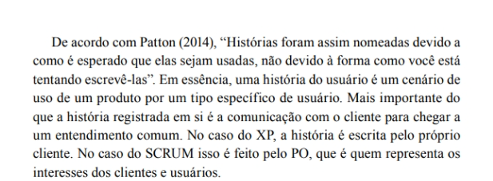
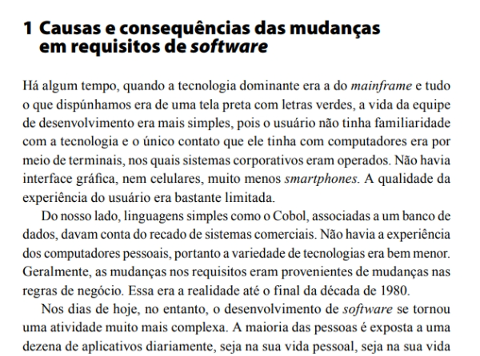
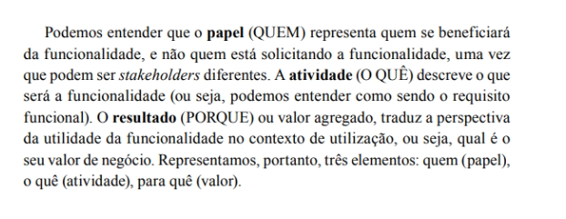
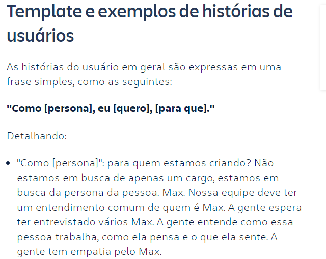
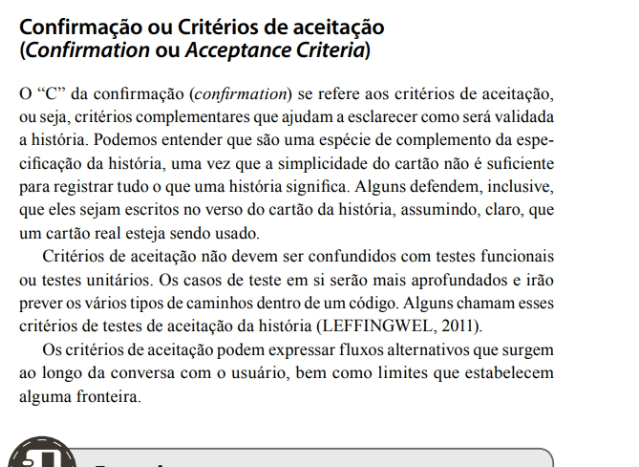
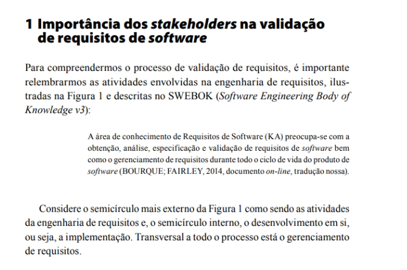

# Verificação das histórias de usuário

## Introdução

Neste documento, será realizada a verificação do artefato "Histórias de Usuário" desenvolvido  nosso grupo, que baseia o projeto no aplicativo do LibreOffice Writer. Sendo realizada a técnica de inspeção como forma de avaliação do artefato, além de seguir o planejamento previamente estabelecido. Na tabela 1, se encontram os metadados do arquivo desenvolvido, enquanto nas tabelas 2 e 3 podem ser vistas as questões a serem avaliadas.

### Cronograma e Participantes

Para efetuar a inspeção e verificação do documento o integrante Rafael Xavier Canabrava também realizou uma gravação dessa atividade para ter uma melhor visão da inspeção efetuada do documento. A gravação foi feita no OBS Studio no dia 27/11/2023, às 11h.

<center>

<iframe width="560" height="315" src="https://www.youtube.com/embed/sKx34k8eWb4?si=S6oHP_ZlOvgxpyK-" title="YouTube video player" frameborder="0" allow="accelerometer; autoplay; clipboard-write; encrypted-media; gyroscope; picture-in-picture; web-share" allowfullscreen></iframe>

<div style="text-align: center">
<p> Gravação 1: Inspeção do documento. (Fonte: Rafael Xavier, 2023). </p>
</div>

</center>

### Inspeção

<center>

| Versão | Autor(es)  |    Revisor(es)         |
| :----: | :--------: | :------------------------: | 
| 1.0  | Artur Seppa | Ana Luíza |

</center>

<div style="text-align: center">
<p> Tabela 1: Metadados do artefato produzido. (Fonte: Rafael Xavier, 2023). </p>
</div>

<center>

|  ID   |                                 Questão                                  | Inspeção |
| :---: | :----------------------------------------------------------------------: | :------: |
|   1   |                 As legendas estão no padrão do projeto?                  |    🟢     |             
|   2   |                  Possui links para os outros artefatos?                  |    🟢     |             
|   3   |                    Existe uma introdução no artefato?                    |    🟢     |             
|   4   |               Existe tabela de versionamento padronizado?                |    🟢     |             
|   5   |        Há referências bibliográficas ou referências no artefato?         |    🟢     |             
|   6   | As tabelas e imagens possuem legenda, fonte e são introduzidas no texto? |    🟢     |             
|   7   |                         O artefato possui autor?                         |    🟢     |             
|   8   |                        O artefato possui revisor?                        |    🟢     |             

</center>

<div style="text-align: center">
<p> Tabela 2: Tabela de avaliação das verificações gerais do artefato. (Fonte: Rafael Xavier, 2023). </p>
</div>

<center>

|  ID   |                                 Questão                                  | Inspeção | 
| :---: | :----------------------------------------------------------------------: | :------: | 
|   9   |       Houve participação do usuário para a criação das histórias? <a id="REF1" href="#anchor_1">[1]</a>      |    🟢    |             
|   10   |       Possui rastreabilidade no requisito origem da história de usuário? <a id="REF2" href="#anchor_2">[2]</a>       |    🔴     |             
|   11  |    As histórias de usuário possuem os 3Ws? (quem? / o quê? / por quê?) <a id="REF3" href="#anchor_3">[3]</a>     |    🔴     |             
|   12  |   As histórias de usuário estão escritas na perspectiva do usuário final? <a id="REF4" href="#anchor_4">[4]</a>     |    🔴     |             
|   13  |        As história de usuário possuem critérios de aceitação? <a id="REF5" href="#anchor_5">[5]</a>         |    🔴     |             
|   14  | As histórias de usuário foram validadas com um usuário final? <a id="REF6" href="#anchor_6">[6]</a>  |    🔴     |             

</center>

<div style="text-align: center">
<p> Tabela 3: Tabela de avaliação das verificações específicas do artefato. (Fonte: Rafael Xavier, 2023). </p>
</div>

## Tarefas

Na tabela 4 encontram-se as tarefas a serem cumpridas para que o artefato seja corrigido.

<center>

| ID Correção | Tarefa         |
| ------------- | -------------- |
| IDC1          | Produzir as histórias de usuário de acordo com a entrevista com o P.O., referenciando os requisitos de origem e usando os 3 Ws  |
| IDC2          | Validar as histórias com o P.O.  |

</center>

<div style="text-align: center">
<p> Tabela 4: Tabela de ajustes a serem feitos. (Fonte: Rafael Xavier, 2023). </p>
</div>

## Acompanhamento

Para saber a porcentagem de aproveitamento do artefato, será utilizado a expressão da Figura 1, no qual a Tabela 5 apresenta o significado dessa legendas.

<div style="text-align: center">


<p> Figura 1: Fórmula para calcular aproveitamento (Fonte: Rafael Xavier, 2023). </p>
</div>

<center>

| Acrônimo  | Descrição                      |
| --------- | ------------------------------ |
| QTDE      | Quantidade Total de Exigências |
| EC        | Exigências Completas           |

<div style="text-align: center">
<p> Tabela 5: Legenda da Figura 1 (Fonte: Rafael Xavier, 2023). </p>
</div>

</center>

### Porcentagem

Nos checklists realizados e que serão descritos, podemos observar que:

- 9/14 exigências são atendidas;
- 0/14 exigências estão incompletas;
- 5/14 exigências estão erradas ou não foram realizadas.

onde 14 é a quantidade de exigências.

```vegalite
{
    "title": "Acompanhamento",
  "$schema": "https://vega.github.io/schema/vega-lite/v5.json",
  "description": "A simple donut chart with embedded data.",
  "data": {
    "values": [
      {"legenda": "Completo", "value": 9},
      {"legenda": "Incompleto", "value": 0},
      {"legenda": "Errado", "value": 5}
    ]
  },
  "mark": {"type": "arc", "innerRadius": 50, "tooltip": true},
  "encoding": {
    "theta": {"field": "value", "type": "quantitative"},
    "color": {
      "field": "legenda",
      "type": "nominal",
      "scale": {
        "domain": ["Completo", "Incompleto", "Errado"],
        "range": ["green", "yellow", "red"]
      }
    }
  }
}
```

<div style="text-align: center">
<p> Gráfico 1: Gráfico de aproveitamento (Fonte: Rafael Xavier, 2023). </p>
</div>

Portanto, com base na formula apresentada, pode-se dizer que o aproveitamento deste artefato está em 64,28% correto.

## Correção 

### Ajustes

Na tabela 6, se encontra os ajustes que o autor do artefato realizou para arrumar o que foi pedido na tabela 4.

<center>

| ID Correção | Ajuste                       |
| ------------- | ---------------------------- |
| IDC1          | Foi ajustado x realizando... |
| IDC2          | Foi incluido x em ...        |
| IDC3          | Foi removido x ...           |
| IDC4          | X foi especificaod melhor... |

<div style="text-align: center">
<p> Tabela 6: Tabela de ajustes feitos (Fonte: Rafael Xavier, 2023). </p>
</div>

</center>


## Referências Bibliográficas

> <a id="REF1" href="#anchor_1">1.</a> REINEHR, Sheila. Página 162, Especificação de requisitos funcionais utilizando histórias de usuário, Engenharia de requisitos. Grupo A, 2020. E-book. ISBN 9786556900674. Disponível em: https://integrada.minhabiblioteca.com.br/#/books/9786556900674/. Acesso em: 04 dez. 2023. Sendo uma referência ilustrada na figura 2 no documento.

<div style="text-align: center;">
  
  
  <p> Figura 2: Identificação das histórias de usuário (Fonte: Rafael Xavier, 2023). </p>
</div>

> <a id="REF2" href="#anchor_2">2.</a> REINEHR, Sheila. Páginas 267 a 270 , Rastreabilidade bidirecional de requisitos de software, Engenharia de requisitos. Grupo A, 2020. E-book. ISBN 9786556900674. Disponível em: https://integrada.minhabiblioteca.com.br/#/books/9786556900674/. Acesso em: 04 dez. 2023. Sendo uma referência ilustrada na figura 3 no documento.

<div style="text-align: center;">
  
  
  <p> Figura 3: Rastreabilidade (Fonte: Rafael Xavier, 2023). </p>
</div>

> <a id="REF3" href="#anchor_3">3.</a> REINEHR, Sheila. Página 163, Especificação de requisitos funcionais utilizando histórias de usuário, Engenharia de requisitos. Grupo A, 2020. E-book. ISBN 9786556900674. Disponível em: https://integrada.minhabiblioteca.com.br/#/books/9786556900674/. Acesso em: 04 dez. 2023. Sendo uma referência ilustrada na figura 4 no documento.

<div style="text-align: center;">
  
  
  <p> Figura 4: Estrutura de uma história de usuário(Fonte: Rafael Xavier, 2023). </p>
</div>

> <a id="REF4" href="#anchor_4">4.</a> Atlassian. Uma história do usuário é uma explicação informal e geral, usada para ilustrar como um software funcionará. Disponível em: https://www.atlassian.com/br/agile/project-management/user-stories#:~:text=usu%C3%A1rio%20do%20software.-,Uma%20hist%C3%B3ria%20do%20usu%C3%A1rio%20%C3%A9%20uma%20explica%C3%A7%C3%A3o%20informal%20e%20geral,um%20determinado%20valor%20ao%20cliente. Acesso em: 04 dez. 2023. Sendo uma referência ilustrada na figura 5 no documento.

<div style="text-align: center;">
  
  
  <p> Figura 5: Perspectiva de uma história de usuário (Fonte: Rafael Xavier, 2023). </p>
</div>

> <a id="REF5" href="#anchor_5">5.</a> REINEHR, Sheila. Páginas 166 a 168, Especificação de requisitos funcionais utilizando histórias de usuário, Engenharia de requisitos. Grupo A, 2020. E-book. ISBN 9786556900674. Disponível em: https://integrada.minhabiblioteca.com.br/#/books/9786556900674/. Acesso em: 04 dez. 2023. Sendo uma referência ilustrada na figura 6 no documento.

<div style="text-align: center;">
  
  
  <p> Figura 6: Critérios de aceitação (Fonte: Rafael Xavier, 2023). </p>
</div>

> <a id="REF6" href="#anchor_6">5.</a> REINEHR, Sheila. Páginas 245 a 251, Validação de requisitos de software, Engenharia de requisitos. Grupo A, 2020. E-book. ISBN 9786556900674. Disponível em: https://integrada.minhabiblioteca.com.br/#/books/9786556900674/. Acesso em: 04 dez. 2023. Sendo uma referência ilustrada na figura 7 no documento.

<div style="text-align: center;">
  
  
  <p> Figura 7: Critérios de aceitação (Fonte: Rafael Xavier, 2023). </p>
</div>

## Histórico de versão

|    Data    | Versão |      Descrição       | Autor(es) | Revisor(es) |
| :--------: | :----: | :------------------: | :-------: | :---------: |
| 26/11/2023 |  1.0   | Criação do documento | Rafael Xavier |   Artur e Raphaela    | 
