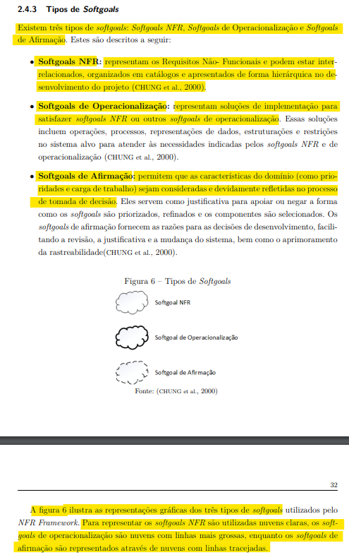
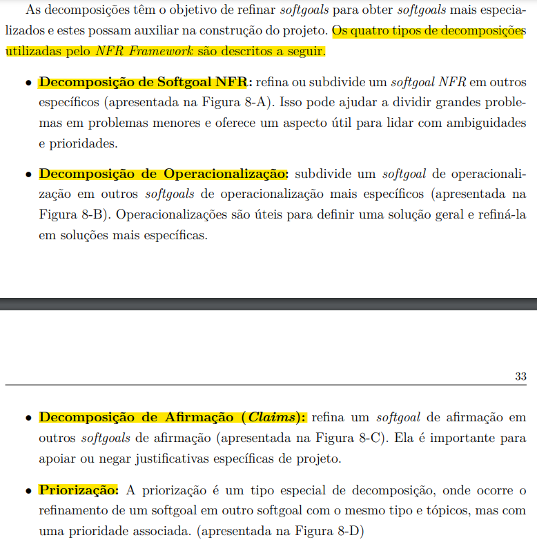
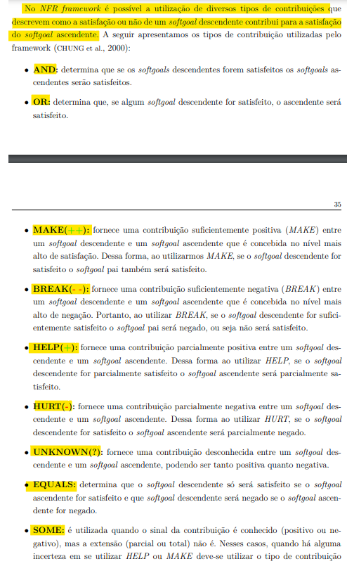
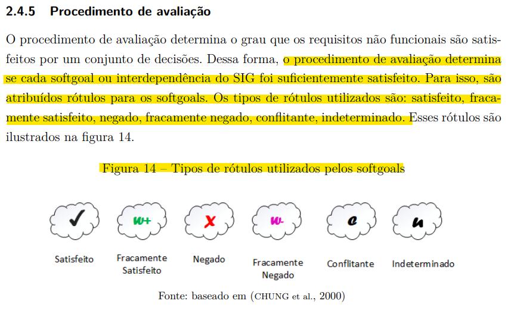

# Verificação do NRF Framework

## Introdução

Neste documento, será realizada a verificação do artefato do NFR framework desenvolvido pela equipe. Sendo realizado a técnica de inspeção como forma de avaliação deste documento, além de seguir o planejamento previamente estabelecido.

### Cronograma e Participantes

Para efetuar a inspeção e verificação do documento os integrantes Artur Seppa Reiman e Ana Leticia realizaram uma gravação dessa atividade para ter uma melhor elucidação e visão da inspeção efetuada do documento. Portanto como cronograma seguido, foi efetuado uma gravação via Teams às 08:12 do dia 01 de dezembro de 2023, como pode ser visto na gravação 1 do artefato.

<center>

<iframe width="560" height="315" src="https://www.youtube.com/embed/4pdLdm-vfs8?si=VymcdCn6NocIvRqy" title="YouTube video player" frameborder="0" allow="accelerometer; autoplay; clipboard-write; encrypted-media; gyroscope; picture-in-picture; web-share" allowfullscreen></iframe>

<div style="text-align: center">
<p> Gravação 1: Inspeção do documento. (Fonte: Artur Seppa Reiman Ana Letícia, 2023). </p>
</div>

</center>

### Inspeção

Para consolidar a inspeção do documento na tabela 1, se encontra os metadados do arquivo desenvolvido, nas tabelas 2 e 3 pode ser visto as questões a serem avaliadas, enquanto na tabela 4 pode ser visto os elementos que precisam ser ajustados e no Gráfico 1 pode ser visto o quanto das exigências foram atendidas.

<center>

| Versão | Autor(es)          | Revisor(es)             |
| :----: | ------------------ | ----------------------- |
| 1.0  | Ana Luíza e Rafael | Ana Letícia e Edilberto |

<div style="text-align: center">
<p> Tabela 1: Metadados do artefato produzido. (Fonte: Artur Seppa Reiman e Ana Letícia, 2023). </p>
</div>

</center>

<center>

| ID  |                                 Questão                                  | Inspeção |
| :-: | :----------------------------------------------------------------------: | :------: |
|  1  |                 As legendas estão no padrão do projeto?                  |    🟢    |
|  2  |                  Possui links para os outros artefatos?                  |    🟡    |
|  3  |                    Existe uma introdução no artefato?                    |    🟢    |
|  4  |               Existe tabela de versionamento padronizado?                |    🟢    |
|  5  |        Há referências bibliográficas ou referências no artefato?         |    🟢    |
|  6  | As tabelas e imagens possuem legenda, fonte e são introduzidas no texto? |    🟡    |
|  7  |                         O artefato possui autor?                         |    🟢    |
|  8  |                        O artefato possui revisor?                        |    🟢    |

</center>
<div style="text-align: center">
<p> Tabela 2: Tabela de avaliação das verificações gerais do artefato. (Fonte: Artur Seppa Reiman e Ana Letícia, 2023). </p>
</div>

</center>

<center>

| ID  |                                                                                                                                                                                                       Questão                                                                                                                                                                                                        | Inspeção |
| :-: | :------------------------------------------------------------------------------------------------------------------------------------------------------------------------------------------------------------------------------------------------------------------------------------------------------------------------------------------------------------------------------------------------------------------: | :------: |
|  9  | O documento elaborado contém todos os tipos de softgoal (Softgoals NFR, Softgoals de Operacionalização e Softgoals de Afirmação) do framework NFR e eles detém a sua correta representação gráfica (softgoals NFR -> nuvens claras, softgoals de operacionalização -> nuvens com linhas mais grossas, e softgoals de afirmação -> nuvens com linhas tracejadas) no documento ? <a href="REF1">[1]</a>  |    🟢    |
| 10  |                                                                                                                                                  A representação dos Softgoals NFR estão em conformidade com suas definições? <a id="REF1" href="REF1">[1]</a>                                                                                                                                                   |    🟢    |
| 11  |                                                                                                                                         A representação dos Softgoals de Operacionalização estão em conformidade com suas definições? <a href="REF1">[1]</a>                                                                                                                                          |    🟢    |
| 12  |                                                                                                                                             A representação dos Softgoals de Afirmação estão em conformidade com suas definições? <a href="REF1">[1]</a>                                                                                                                                              |    🟢    |
| 13  |                A decomposição de softgoals NFR elaborada no projeto, foi corretamente utilizada para subdividir os macros objetivos em partes menores e mais específicas ? Podendo ser utilizado os 4 tipos de decomposições (Decomposição de Softgoal NFR, Decomposição de Softgoal NFR, Decomposição de Softgoal NFR e Priorização) no documento do projeto. <a href="REF2">[2]</a>             |    🟢    |
| 14  |                                                                                                                                    No documento, os cartões de especificação representam requisitos não-funcionais que podem ser testáveis? <a href="REF3">[3]</a>                                                                                                                                    |    🟡    |
| 15  |                                              A aplicação dos tipos de contribuição demonstram como a satisfação ou não de um softgoal descendente contribui para a satisfação do softgoal ascendente ? Os possíveis tipos de contribuição (AND, OR, MAKE, BREAK, HELP, HURT, UNKNOWN, EQUALS, SOME) foram aplicados no projeto ? <a href="REF4">[4]</a>                                               |    🟢    |
| 16  |                                                            Dado o procedimento de avaliação de softgoals para indicar a satisfação deles. Foi indicado corretamente rótulos (satisfeito, fracamente satisfeito, negado, fracamente negado, conflitante, indeterminado) para as interdependência do SIG no sistema ? <a href="REF5">[5]</a>                                                            |    🟢    |

<div style="text-align: center">
<p> Tabela 3: Tabela de avaliação das verificações específicas do artefato. (Fonte: Artur Seppa Reiman e Ana Letícia, 2023). </p>
</div>

</center>

<center>

### Tarefas

| ID Correção | Tarefa                                                                                                                                                                                                                                                                                                                                                                                                                                                                                                                                                                        |
| ----------- | ----------------------------------------------------------------------------------------------------------------------------------------------------------------------------------------------------------------------------------------------------------------------------------------------------------------------------------------------------------------------------------------------------------------------------------------------------------------------------------------------------------------------------------------------------------------------------- |
| IDC1        | Ajustar o link de redirecionamento do repositório da disciplina do Simplenote na bibliografia do documento.                                                                                                                                                                                                                                                                                                                                                                                                                                                                   |
| IDC2        | Incluir a legenda e a introdução da última tabela de requisitos elicitados que se encontra no final do documento.                                                                                                                                                                                                                                                                                                                                                                                                                                                             |
| IDC3        | Ajustar as limitações específicas do softgoal a fim de tornar o requisito testável. Dentro da especificação de requisito de compatibilidade e portabilidade poderia ser mais especifico a compatibilidade do aplicativo com diferentes versões de dispositivos, assim com diferentes versões e tipos de browsers. Além disso, na especificação de requisito de desempenho a descrição do requisito poderia ser mais acurada, especificando mais a forma da eficiência de consumo de recursos do sistema, indicando de forma breve como pode ser feita para torna-lá testável. |

<div style="text-align: center">
<p> Tabela 4: Tabela do que precisa ser ajustado (Fonte: Artur Seppa Reiman e Ana Letícia, 2023). </p>
</div>

</center>

## Acompanhamento

Para saber a porcentagem de aproveitamento do artefato, será utilizado a expressão da Figura 1, no qual a Tabela 5 apresenta o significado dessa legendas.

<div style="text-align: center">


<p> Figura 1: Fórmula para calcular aproveitamento (Fonte: Ana Luíza, 2023). </p>
</div>

<center>

| Acrônimo | Descrição                      |
| -------- | ------------------------------ |
| QTDE     | Quantidade Total de Exigências |
| EC       | Exigências Completas           |

<div style="text-align: center">
<p> Tabela 5: Legenda da Figura 1 (Fonte: Ana Luíza, 2023). </p>
</div>

</center>

### Porcentagem

Nos checklists realizados e que serão descritos, podemos observar que:

- 13/16 exigências são atendidas;
- 3/16 exigências estão incompletas;
- 0/16 exigências estão erradas ou não foram realizadas.

onde 16 é a quantidade de exigências.

```vegalite
{
    "title": "Acompanhamento",
  "$schema": "https://vega.github.io/schema/vega-lite/v5.json",
  "description": "A simple donut chart with embedded data.",
  "data": {
    "values": [
      {"legenda": "Completo", "value": 13},
      {"legenda": "Incompleto", "value": 3}
    ]
  },
  "mark": {"type": "arc", "innerRadius": 50, "tooltip": true},
  "encoding": {
    "theta": {"field": "value", "type": "quantitative"},
    "color": {
      "field": "legenda",
      "type": "nominal",
      "scale": {
        "domain": ["Completo", "Incompleto", "Errado"],
        "range": ["green", "yellow", "red"]
      }
    }
  }
}
```

<div style="text-align: center">
<p> Gráfico 1: Gráfico de aproveitamento (Fonte: Artur Seppa Reiman e Ana Letícia, 2023). </p>
</div>

Portanto, com base na fórmula apresentada, pode-se dizer que o aproveitamento deste artefato está em 81.30% correto.

### Correção

<center>

### Ajustes

Na tabela 6, se encontra os ajustes que o autor do artefato realizou para arrumar o que foi pedido na tabela 4.

| ID Correção | Ajuste                       |
| ----------- | ---------------------------- |
| IDC1        | Foi ajustado x realizando... |
| IDC2        | Foi incluido x em ...        |
| IDC3        | Foi removido x ...           |
| IDC4        | X foi especificaod melhor... |

<div style="text-align: center">
<p> Tabela 6: Tabela de ajustes feitos (Fonte: Ana Luíza, 2023). </p>
</div>

</center>

## Referências Bibliográficas

><p id="REF1">[1] SILVA, Reinaldo Antônio. Página: 31, Capítulo 2. Nfr4es: Um catálogo de requisitos nao-funcionais para sistemas embarcados. 2019. Dissertação de Mestrado. Universidade Federal de Pernambuco. Disponível em: <https://repositorio.ufpe.br/handle/123456789/34150> Acesso em: 16 novembro 2023. Sendo uma referência ilustrada na figura 2 no documento. </p>

<div style="text-align: center;">
  
  
  <p> Figura 2: Tipos de Softgoals (Fonte: SILVA, Reinaldo Antônio, p. 31. Grifos de Artur Seppa Reiman, 2023). </p>
</div>

> <p id="REF12">[2] SILVA, Reinaldo Antônio. Página: 32-33, Capítulo 2. Nfr4es: Um catálogo de requisitos nao-funcionais para sistemas embarcados. 2019. Dissertação de Mestrado. Universidade Federal de Pernambuco. Disponível em: <https://repositorio.ufpe.br/handle/123456789/34150> Acesso em: 16 novembro 2023. Sendo uma referência ilustrada na figura 3 no documento. </p>

<div style="text-align: center;">
  
  
  <p> Figura 3: Tipos de decomposições (Fonte: SILVA, Reinaldo Antônio, p. 32-33. Grifos de Artur Seppa Reiman). </p>
</div>

> <p id="REF3">[3] MESQUITA, Renato Cardoso. Página: 2, Capítulo 3. Engenharia dos requisitos de software. Disponível em: <https://www.cin.ufpe.br/~joa/menu_options/school/cursos/engsoft/aulas/requisitos-conceitos.pdf>. Acesso em: 28 novembro 2023. Sendo uma referência ilustrada na figura 4 no documento. </p>

<div style="text-align: center;">
  
  
  <p> Figura 4: Requisitos testáveis (Fonte: MESQUITA, Renato Cardoso, p. 2. Grifos de Artur Seppa Reiman). </p>
</div>

> <p id="REF4">[4] SILVA, Reinaldo Antônio. Página: 34-35, Capítulo 2. Nfr4es: Um catálogo de requisitos nao-funcionais para sistemas embarcados. 2019. Dissertação de Mestrado. Universidade Federal de Pernambuco. Disponível em: <https://repositorio.ufpe.br/handle/123456789/34150> Acesso em: 16 novembro 2023. Sendo uma referência ilustrada na figura 5 no documento. </p>

<div style="text-align: center;">
  
  
  <p> Figura 5: Tipos de contribuições (Fonte: SILVA, Reinaldo Antônio, p. 38. Grifos de Artur Seppa Reiman). </p>
</div>

> <p id="REF5">[5] SILVA, Reinaldo Antônio. Página: 38, Capítulo 2. Nfr4es: Um catálogo de requisitos nao-funcionais para sistemas embarcados. 2019. Dissertação de Mestrado. Universidade Federal de Pernambuco. Disponível em: <https://repositorio.ufpe.br/handle/123456789/34150> Acesso em: 16 novembro 2023. Sendo uma referência ilustrada na figura 6 no documento. </p>

<div style="text-align: center;">
  
  
  <p> Figura 6: Procedimento de avaliação (Fonte: SILVA, Reinaldo Antônio, p. 38. Grifos de Artur Seppa Reiman). </p>
</div>

## Histórico de Versão

| Versão | Data       | Descrição                                             | Autor(es)                        | Revisor(es)                  |
| ------ | ---------- | ----------------------------------------------------- | -------------------------------- | ---------------------------- |
| 1.0    | 27/11/2023 | Criação e desenvolvimento do documento de verificação | Artur Seppa Reiman e Ana Letícia | Ana Luíza e Rafael |
