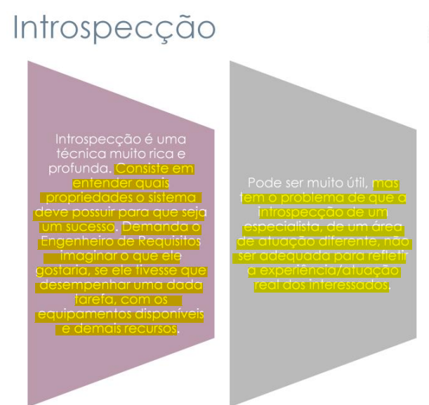
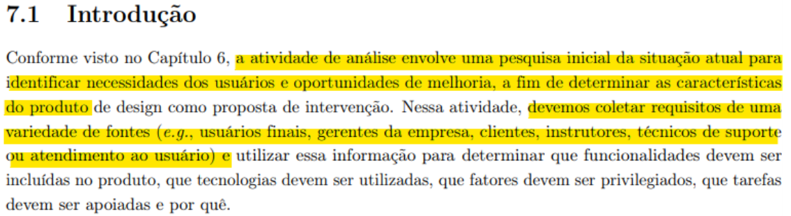
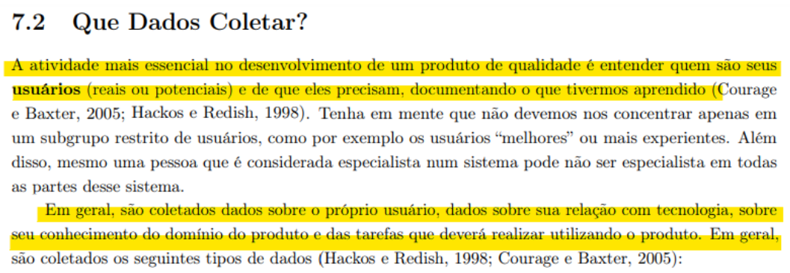
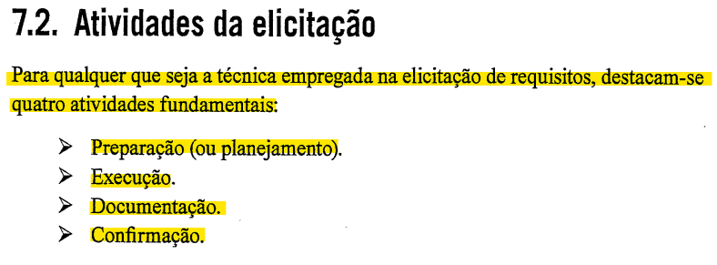
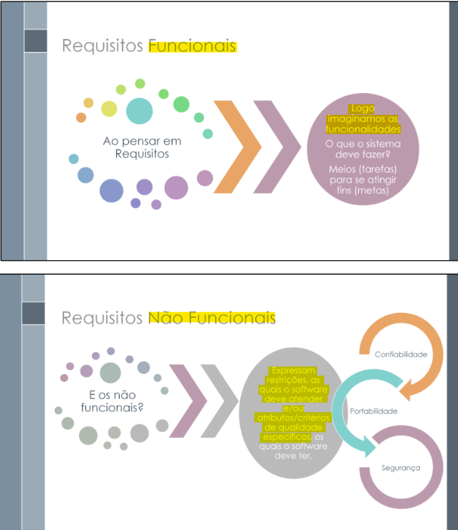

# Verificação da Introspeção

## Introdução

Neste documento, será realizada a verificação do artefato da instrospecção desenvolvido pela equipe. Sendo realizado a técnica de inspeção como forma de avaliação deste documento, além de seguir o planejamento previamente estabelecido.

### Cronograma e Participantes

Para efetuar a inspeção e verificação do documento o integrante Artur Seppa Reiman realizou uma gravação dessa atividade para ter uma melhor elucidação e visão da inspeção efetuada do documento. Portanto como cronograma seguido, foi efetuado uma gravação via Teams às 18:30 do dia 25 de novembro de 2023, como pode ser visto na gravação 1 do artefato.

Além disso, a correção do artefato junto com o seu responsável foi feita às 18:40 do dia 04 de dezembro de 2023, como pode ser visto na gravação 2 do artefato.

<center>

<iframe width="560" height="315" src="https://www.youtube.com/embed/0zVw27uOprs?si=UnjnVD9LObyolAbk" title="YouTube video player" frameborder="0" allow="accelerometer; autoplay; clipboard-write; encrypted-media; gyroscope; picture-in-picture; web-share" allowfullscreen></iframe>

<div style="text-align: center">
<p> Gravação 1: Inspeção do documento. (Fonte: Artur Seppa Reiman, 2023). </p>
</div>

</center>

<center>

<iframe width="560" height="315" src="https://www.youtube.com/embed/kAZqM7sz0LU?si=DefAQUpLCJZuN0Ex" title="YouTube video player" frameborder="0" allow="accelerometer; autoplay; clipboard-write; encrypted-media; gyroscope; picture-in-picture; web-share" allowfullscreen></iframe>

<div style="text-align: center">
<p> Gravação 2: Correção do documento. (Fonte: Artur Seppa Reiman, 2023). </p>
</div>

</center>

### Inspeção

Para consolidar a inspeção do documento na tabela 1, se encontra os metadados do arquivo desenvolvido, nas tabelas 2 e 3 pode ser visto as questões a serem avaliadas, enquanto na tabela 4 pode ser visto os elementos que precisam ser ajustados e no Gráfico 1 pode ser visto o quanto das exigências foram atendidas.

<center>

| Versão | Autor(es)           | Revisor(es)   |
| :----: | ------------------- | ------------- |
| 1.0  | Edilberto Cantuaria | Rafael Xavier |

<div style="text-align: center">
<p> Tabela 1: Metadados do artefato produzido. (Fonte: Artur Seppa Reiman, 2023). </p>
</div>

</center>

<center>

| ID  |                                 Questão                                  | Inspeção | Observações                                                                 |
| :-: | :----------------------------------------------------------------------: | :------: | --------------------------------------------------------------------------- |
|  1  |                 As legendas estão no padrão do projeto?                  |    🟡    | A legenda da tabela 2 está fora do padrão do projeto.                       |
|  2  |                  Possui links para os outros artefatos?                  |   N/A    |                                                                             |
|  3  |                    Existe uma introdução no artefato?                    |    🟢    |                                                                             |
|  4  |               Existe tabela de versionamento padronizado?                |    🟡    | Possui um erro de digitação a ser corrigido no título da coluna de autores. |
|  5  |        Há referências bibliográficas ou referências no artefato?         |    🟢    |                                                                             |
|  6  | As tabelas e imagens possuem legenda, fonte e são introduzidas no texto? |    🟢    |                                                                             |
|  7  |                         O artefato possui autor?                         |    🟢    |                                                                             |
|  8  |                        O artefato possui revisor?                        |    🟢    |                                                                             |

</center>
<div style="text-align: center">
<p> Tabela 2: Tabela de avaliação das verificações gerais do artefato. (Fonte: Artur Seppa Reiman, 2023). </p>
</div>

</center>

<center>

| ID  | Questão                                                                                                                                                                                                                                                                                                                        | Inspeção |
| :-: | ------------------------------------------------------------------------------------------------------------------------------------------------------------------------------------------------------------------------------------------------------------------------------------------------------------------------------ | :------: |
| 9  | Em conformidade com os princípios de introspecção, o artefato criado tem como objetivo retratar, explicar e executar de maneira adequada ao conceito da técnica, o processo de elicitação ? [1]                                                                                                                                                                                                                                                   |    🟢    |
| 10  | A fim de elucidar o ponto de elicitação de requisitos com diversas fontes. [2] No documento, foi levado em consideração de que essa técnica pode não estar totalmente condizente com a visão do usuário, já que é executada por membros da equipe do projeto ? [1]                                                                                                                                                                                                                            |    🟢    |  
| 11  | A fim de efetuar a elicitação de requisitos com base na visão do membro de equipe, foi especificado de forma geral as informações do engenheiro de requisito frente ao produto para ter uma melhor idealização do tipo de usuário que está efetuando o levantamento de requisitos ? Exemplo de dados: dados demográficos, educação, experiência com computadores, experiência com um produto específico ou ferramentas semelhantes, tarefas realizadas e entre outros. [3]                                                                                                                                                                                                                  |    🟡    |
| 12  | No documento elaborado foi efetuado e documentado as 4 atividades essenciais (planejamento, execução, documentação e confirmação) de elicitação de requisitos ? [4]                                                                                                                                                                                                                 |    🟡    |
| 13  | Os requisitos elicitados foram classificados corretamente, sendo abordados como funcionais e não-funcionais no documento ? [5]                                                                                                                                                                                                                 |    🟢    |

<div style="text-align: center">
<p> Tabela 3: Tabela de avaliação das verificações específicas do artefato. (Fonte: Artur Seppa Reiman, 2023). </p>
</div>

</center>

<center>

### Tarefas

| ID Correção | Tarefa                                                                                   |
| ----------- | ---------------------------------------------------------------------------------------- |
| IDC1        | Ajustar a legenda da tabela 2 para ficar padronizada com os outros artefatos do projeto. |
| IDC2        | Corrigir o erro de digitação no título da coluna de autores da tabela de versionamento.  |
| IDC3        | Impor a visualização do tipo de usuário (membro de equipe) que está efetuando a elicitação de requisitos.   |
| IDC4        | A fim de seguir as 4 atividades essenciais de elicitação, escrever o planejamento da técnica de elicitação feita no documento, abordando sobre o cronograma com data, hora e local que foi feita a elicitação de requisitos.   |

<div style="text-align: center">
<p> Tabela 4: Tabela do que precisa ser ajustado (Fonte: Artur Seppa Reiman, 2023). </p>
</div>

</center>

## Acompanhamento

Para saber a porcentagem de aproveitamento do artefato, será utilizado a expressão da Figura 1, no qual a Tabela 5 apresenta o significado dessa legendas.

<div style="text-align: center">


<p> Figura 1: Fórmula para calcular aproveitamento (Fonte: Ana Luíza, 2023). </p>
</div>

<center>

| Acrônimo | Descrição                      |
| -------- | ------------------------------ |
| QTDE     | Quantidade Total de Exigências |
| EC       | Exigências Completas           |

<div style="text-align: center">
<p> Tabela 5: Legenda da Figura 1 (Fonte: Ana Luíza, 2023). </p>
</div>

</center>

### Porcentagem

Nos checklists realizados e que serão descritos, podemos observar que:

- 8/13 exigências são atendidas;
- 4/13 exigências estão incompletas;
- 0/13 exigências estão erradas ou não foram realizadas;
- 1/13 exigências não se aplicam;


onde 15 é a quantidade de exigências.

```vegalite
{
  "title": "Acompanhamento",
  "$schema": "https://vega.github.io/schema/vega-lite/v5.json",
  "description": "A simple donut chart with embedded data.",
  "data": {
    "values": [
      {"legenda": "Completo", "value": 9},
      {"legenda": "Incompleto", "value": 3},
      {"legenda": "Errado", "value": 3}
    ]
  },
  "mark": {"type": "arc", "innerRadius": 50},
  "encoding": {
    "theta": {"field": "value", "type": "quantitative"},
    "color": {
      "field": "legenda",
      "type": "nominal",
      "scale": {
        "domain": ["Completo", "Incompleto", "Errado"],
        "range": ["green", "yellow", "red"]
      }
    }
  }
}
```

<div style="text-align: center">
<p> Gráfico 1: Gráfico de aproveitamento (Fonte: Artur Seppa Reiman, 2023). </p>
</div>

Portanto, com base na fórmula apresentada, pode-se dizer que o aproveitamento deste artefato está em 80% correto.

### Correção

<center>

### Ajustes

Na tabela 6, se encontra os ajustes que o autor do artefato realizou para arrumar o que foi pedido na tabela 4.

| ID Correção | Ajuste                       |
| ----------- | ---------------------------- |
| IDC1        | Foi adicionado o perfil do Engenheiro de Requisitos que realizou a técnica de introspecção |
| IDC2        | Foi inlcuido maiores detalhes sobre o planejamento      |
| IDC3        | Gravação de um vídeo com o cliente para validar os requisitos eliticados e saber a opinião dele sobre           |
| IDC4        | Ajuste nas legendas e tabelas para ficar em conformidade ao padrão do projeto |

<div style="text-align: center">
<p> Tabela 7: Tabela de ajustes feitos (Fonte: Ana Luíza, 2023). </p>
</div>

</center>

## Referência Bibliográfica

> [1] SERRANO, Milene; SERRANO, Maurício. Requisitos (Aula 07): Elicitação, Modelagem e Análise. 2022. Apresentação de Power Point. 50 slides. color. Disponível em: <https://aprender3.unb.br/pluginfile.php/2692772/mod_resource/content/2/Requisitos%20-%20Aula%2007.pdf>. Acesso em: 03 dezembro 2023. Sendo uma referência ilustrada na figura 2 no documento.

<div style="text-align: center;">
  
  
  <p> Figura 2: Técnica de introspecção (Fonte: SERRANO, Milene. Grifado por Artur Seppa Reiman, 2023). </p>
</div>

> [2] Página: 135, Capítulo 7. Barbosa, S. D. J., Silva, B. D., Silveira, M. S., Gasparini, I., Darin, T., & Barbosa, G. D. J. (2021). Interação humano-computador e experiência do usuário. Auto publicação, 2021. Acesso em: 03 dezembro 2023. Sendo uma referência ilustrada na figura 3 no documento.

<div style="text-align: center;">
  
  
  <p> Figura 3: Fontes de usuários (Fonte: Barbosa, S. D. J. Grifado por Artur Seppa Reiman, 2023). </p>
</div>

> [3] Página: 137, Capítulo 7. Barbosa, S. D. J., Silva, B. D., Silveira, M. S., Gasparini, I., Darin, T., & Barbosa, G. D. J. (2021). Interação humano-computador e experiência do usuário. Auto publicação, 2021. Acesso em: 03 dezembro 2023. Sendo uma referência ilustrada na figura 4 no documento.

<div style="text-align: center;">
  
  
  <p> Figura 4: Tipos de usuários (Fonte:  Barbosa, S. D. J. Grifado por Artur Seppa Reiman, 2023). </p>
</div>


> [4] Página 141, Capítulo 7. Eduardo, Antonio, et al. ENGENHARIA DE REQUISITOS. Disponível em: <https://aprender3.unb.br/pluginfile.php/2692771/mod_resource/content/3/Elicitacao%20de%20Req%202.pdf>. Acesso em: 03 dezembro 2023. Sendo uma referência ilustrada na figura 5 no documento.

<div style="text-align: center;">
  
  
  <p> Figura 5: Atividades de elicitação (Fonte: Eduardo, Antonio, et al. Grifado por Artur Seppa Reiman, 2023). </p>
</div>

> [5] Página 33-35. SERRANO, Milene, et al. Requisitos - Aula 13. Disponível em: <https://aprender3.unb.br/pluginfile.php/2692733/mod_resource/content/1/Requisitos%20-%20Aula%2003.pdf>. Acesso em: 03 dezembro 2023. Sendo uma referência ilustrada na figura 6 no documento.

<div style="text-align: center;">
  
  
  <p> Figura 6: Tipos de requisitos (Fonte: SERRANO, Milene, et al. Grifado por Artur Seppa Reiman, 2023). </p>
</div>

## Histórico de Versão

| Versão | Data       | Descrição                                             | Autor              | Revisor       |
| ------ | ---------- | ----------------------------------------------------- | ------------------ | ------------- |
| 1.0    | 25/11/2023 | Criação e desenvolvimento do documento de verificação | Artur Seppa Reiman | Rafael Xavier |
| 1.1    | 06/12/2023 | Alterações na tabela de ajuste | Edilberto Cantuaria | Artur Seppa Reiman |
