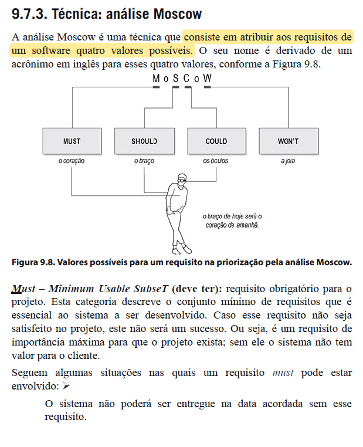
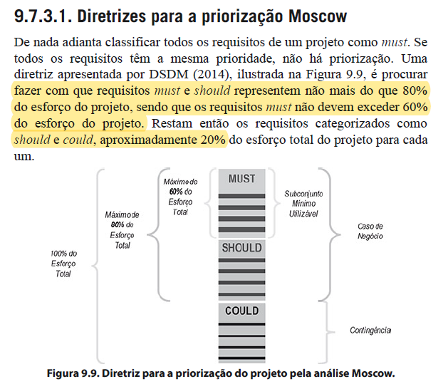
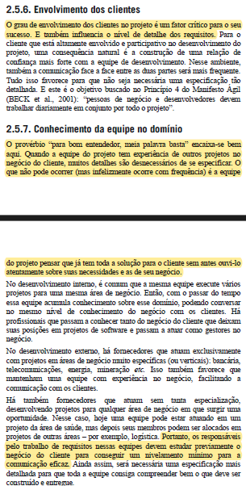

# Verificação da técnica Moscow

## Introdução

Neste documento, será realizada a verificação do artefato da técnica de priorização [Moscow](../../../elicitacao/priorizacao/moscow.md) desenvolvido pela equipe. Sendo realizado a técnica de inspeção como forma de avaliação deste documento, além de seguir o planejamento previamente estabelecido.

### Cronograma e Participantes

Para efetuar a inspeção e verificação do documento o integrante Edilberto Cantuaria realizou uma gravação dessa atividade para ter uma melhor elucidação e visão da inspeção efetuada do documento. Portanto como cronograma seguido, foi efetuado uma gravação via Teams às 01:14 do dia 04 de dezembro de 2023, como pode ser visto na gravação 1 do artefato.

<center>

<iframe width="560" height="315" src="https://youtu.be/63p5XU0l9zE" title="YouTube video player" frameborder="0" allow="accelerometer; autoplay; clipboard-write; encrypted-media; gyroscope; picture-in-picture; web-share" allowfullscreen></iframe>

<div style="text-align: center">
<p> Gravação 1: Inspeção do documento. (Fonte: Edilberto Cantuaria, 2023). </p>
</div>

</center>

### Inspeção

Para consolidar a inspeção do documento na tabela 1, se encontra os metadados do arquivo desenvolvido, nas tabelas 2 e 3 pode ser visto as questões a serem avaliadas, enquanto na tabela 4 pode ser visto os elementos que precisam ser ajustados e no Gráfico 1 pode ser visto o quanto das exigências foram atendidas.

<center>

| Versão | Autor(es)            | Revisor(es)   |
| :----: | -------------------- | ------------- |
| `1.0`  | Raphaela Guimararães | Rafael Xavier |

<div style="text-align: center">
<p> Tabela 1: Metadados do artefato produzido. (Fonte: Edilberto Cantuaria, 2023). </p>
</div>

</center>

<center>

|  ID   |                                 Questão                                  | Inspeção | Observações                                                               |
| :---: | :----------------------------------------------------------------------: | :------: | ------------------------------------------------------------------------- |
|   1   |                 As legendas estão no padrão do projeto?                  |    🟢     |                                                                           |
|   2   |                  Possui links para os outros artefatos?                  |    🟡     | Colocar links que levem para os artefatos da Introspecção e Brainstorming |
|   3   |                    Existe uma introdução no artefato?                    |    🟢     |                                                                           |
|   4   |               Existe tabela de versionamento padronizado?                |    🟢     |                                                                           |
|   5   |        Há referências bibliográficas ou referências no artefato?         |    🟢     |                                                                           |
|   6   | As tabelas e imagens possuem legenda, fonte e são introduzidas no texto? |    🟢     |                                                                           |
|   7   |                         O artefato possui autor?                         |    🟢     |                                                                           |
|   8   |                        O artefato possui revisor?                        |    🟢     |                                                                           |

</center>
<div style="text-align: center">
<p> Tabela 2: Tabela de avaliação das verificações gerais do artefato. (Fonte: Edilberto Cantuaria, 2023). </p>
</div>

</center>

<center>

|  ID   | Questão                                                                                                                                    | Inspeção |
| :---: | ------------------------------------------------------------------------------------------------------------------------------------------ | :------: |
|   9   | Os requisitos foram classificados como Must Have (Deve ter), Should Have (Deveria ter), Could Have (Poderia ter) ou Won't Have (Não terá)? [1]|    🟢     |
|  10   | As justificativas para a classificação de cada requisito estão documentadas e são coerentes com as necessidades do projeto?                |    🔴     |
|  11   | A participação do cliente e/ou persona no processo de priorização? [1]                                                                        |    🔴     |
|  12  | Os requisitos classificados em *must* e *should* correspondem a 80% de todo o projeto ?     [1]                                               |   🟡    |

<div style="text-align: center">
<p> Tabela 3: Tabela de avaliação das verificações específicas do artefato. (Fonte: Edilberto Cantuaria, 2023). </p>
</div>

</center>

<center>

### Tarefas

| ID Correção | Tarefa                                                                                   |
| ----------- | ---------------------------------------------------------------------------------------- |
| IDC10 e IDC11        | Incluir um documento em que haja a validação de um usuário ou stakeholders. Uma sugestão que pode casar bem com o artefato é este [vídeo](https://www.youtube.com/watch?v=wZxL0vVdUFY), em que o integrante Artur Seppa conversa com um Product Owner e pode agregar muito valor às priorizações. |
| IDC12        | De fato, muitos requisitos elicitados pela técnica de introspecção e brainstorming estão convergindo para um mesmo ponto, mas seria melhor agrupar os requisitos por categorias. Por exemplo o item `INT14` e o item `BS23` poderiam ficar em uma única linha da tabela e tal prática pode evitar dualidades, evitando que requisitos semelhantes sejam priorizados de formas distintas. Dito isto, percebesse que muito provavelmnente os requisitos *must* e *should* estão dentro dos 80% esperados, mas será proveitoso e mitigará falhas com uma tabela mais organizada e menos redundante|

<div style="text-align: center">
<p> Tabela 4: Tabela do que precisa ser ajustado (Fonte: Edilberto Cantuaria, 2023). </p>
</div>

</center>

## Acompanhamento

Para saber a porcentagem de aproveitamento do artefato, será utilizado a expressão da Figura 1, no qual a Tabela 5 apresenta o significado dessa legendas.

<div style="text-align: center">


<p> Figura 1: Fórmula para calcular aproveitamento (Fonte: Ana Luíza, 2023). </p>
</div>

<center>

| Acrônimo | Descrição                      |
| -------- | ------------------------------ |
| QTDE     | Quantidade Total de Exigências |
| EC       | Exigências Completas           |

<div style="text-align: center">
<p> Tabela 5: Legenda da Figura 1 (Fonte: Ana Luíza, 2023). </p>
</div>

</center>

### Porcentagem

Nos checklists realizados e que serão descritos, podemos observar que:

- 8/12 exigências são atendidas;
- 2/12 exigências estão incompletas;
- 2/12 exigências estão erradas ou não foram realizadas;
- 0/12 exigências não se aplicam;

onde 12 é a quantidade de exigências.

```vegalite
{
    "title": "Acompanhamento",
  "$schema": "https://vega.github.io/schema/vega-lite/v5.json",
  "description": "A simple donut chart with embedded data.",
  "data": {
    "values": [
      {"legenda": "Completo", "value": 8},
      {"legenda": "Incompleto", "value": 2},
      {"legenda": "Errado ou não realizado", "value": 2}
    ]
  },
  "mark": {"type": "arc", "innerRadius": 50, "tooltip": true},
  "encoding": {
    "theta": {"field": "value", "type": "quantitative"},
    "color": {
      "field": "legenda",
      "type": "nominal",
      "scale": {
        "domain": ["Completo", "Incompleto", "N\A"],
        "range": ["green", "yellow", "red"]
      }
    }
  }
}
```

<div style="text-align: center">
<p> Gráfico 1: Gráfico de aproveitamento (Fonte: Edilberto Cantuaria, 2023). </p>
</div>

Portanto, com base na fórmula apresentada, pode-se dizer que o aproveitamento deste artefato está em 66.67% correto.

### Correção

<center>

### Ajustes

Na tabela 6,
.

| ID Correção | Ajuste                       |
| ----------- | ---------------------------- |
| IDC1        | Foi ajustado x realizando... |
| IDC2        | Foi incluido x em ...        |
| IDC3        | Foi removido x ...           |
| IDC4        | X foi especificaod melhor... |

<div style="text-align: center">
<p> Tabela 6: Tabela de ajustes feitos (Fonte: Ana Luíza, 2023). </p>
</div>

</center>

## Referência Bibliográfica

> [1] VAZQUEZ, Carlos Eduardo; SIMÕES, Guilherme Siqueira. Engenharia de Requisitos: software orientado ao negócio. Rio de Janeiro: Brasport, 2016. Páginas 65,66, 384, 386. [Imagens anexadas](#anexos).
 
## Bibliografia

> FERNANDO, Sidney. Verificação da técnica Moscow do Grupo. Repositório da disciplina de Requisitos de Software da Universidade de Brasília, 2023. Disponível em: https://requisitos-de-software.github.io/2023.1-BilheteriaDigital/verificacao/grupo2/entrega2/moscow2/. Acesso em: 04 dezembro 2023.


## Histórico de Versão

| Versão | Data       | Descrição                                             | Autor              | Revisor       |
| ------ | ---------- | ----------------------------------------------------- | ------------------ | ------------- |
| 1.0    | 25/11/2023 | Criação e desenvolvimento do documento de verificação | Edilberto Cantuaria | Raphaela |


## Anexos 
<center>

<div style="text-align: center">

<p> Figura 1: Texto base para o item 09 do checklist. (Fonte: VAZQUEZ, Carlos Eduardo. Engenharia de Requisitos: software orientado ao negócio. Página 384) </p>
</div>


<div style="text-align: center">

<p> Figura 2: Texto base para o item 12 do checklist. (Fonte: VAZQUEZ, Carlos Eduardo. Engenharia de Requisitos: software orientado ao negócio. Página 386) </p>
</div>


<div style="text-align: center">

<p> Figura 3: Texto base para o item 11 do checklist. (Fonte: VAZQUEZ, Carlos Eduardo. Engenharia de Requisitos: software orientado ao negócio. Página 65 e 66) </p>
</div>

</center>