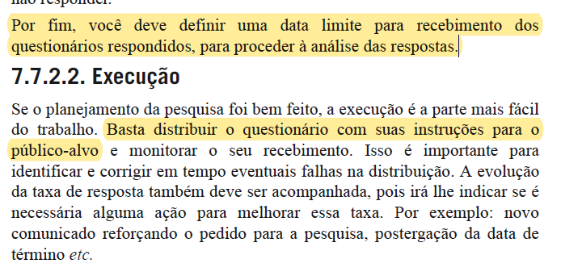
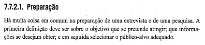
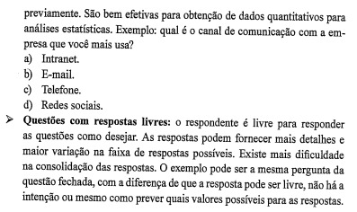
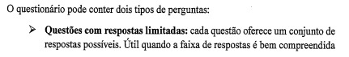
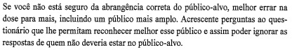
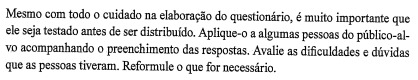
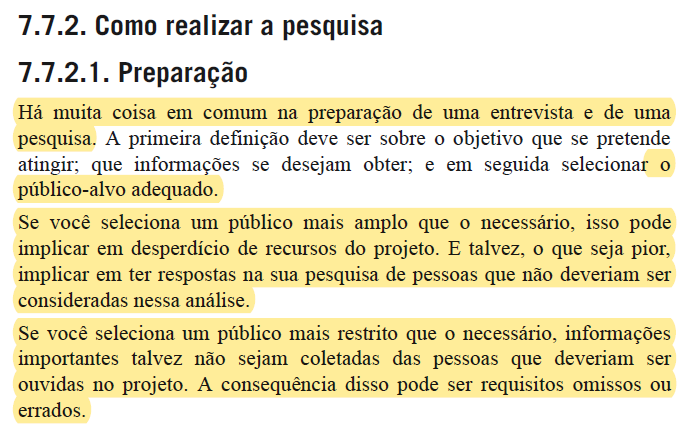
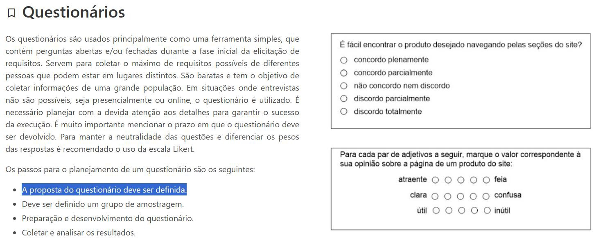
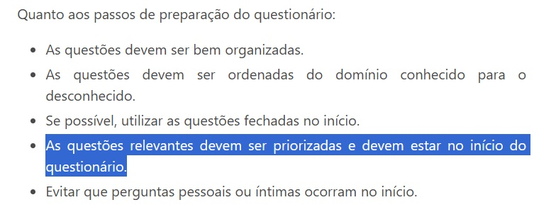
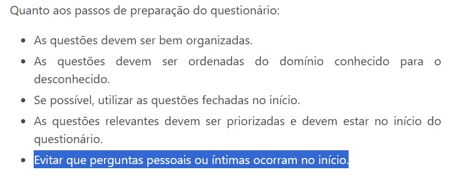

# Verificação da técnica Questionário

## Introdução

Neste documento, será realizada a verificação do artefato da técnica de elicitação [Questionário](../../../elicitacao/questionario.md) desenvolvido pela equipe. Sendo realizado a técnica de inspeção como forma de avaliação deste documento, além de seguir o planejamento previamente estabelecido.

### Cronograma e Participantes

Para efetuar a inspeção e verificação do documento os integrante Ana Letícia e Edilberto Cantuaria realizaram uma gravação dessa atividade para ter uma melhor elucidação e visão da inspeção efetuada do documento. Portanto como cronograma seguido, foi efetuado uma gravação via Teams às 12:30 do dia 04 de dezembro de 2023, como pode ser visto na gravação 1 do artefato.

<center>

<iframe width="560" height="315" src="https://www.youtube.com/embed/WYBXHQWgwEo?si=xpBLcPC8Ig2bCc0y" title="YouTube video player" frameborder="0" allow="accelerometer; autoplay; clipboard-write; encrypted-media; gyroscope; picture-in-picture; web-share" allowfullscreen></iframe>

<div style="text-align: center">
<p> Gravação 1: Inspeção do documento. (Fonte: Ana Letícia e Edilberto Cantuaria, 2023). </p>
</div>

</center>

### Inspeção

Para consolidar a inspeção do documento na tabela 1, se encontra os metadados do arquivo desenvolvido, nas tabelas 2 e 3 pode ser visto as questões a serem avaliadas, enquanto na tabela 4 pode ser visto os elementos que precisam ser ajustados e no Gráfico 1 pode ser visto o quanto das exigências foram atendidas.

<center>

| Versão | Autor(es)   | Revisor(es) |
| :----: | ----------- | ----------- |
|  1.4   | Ana Letícia | Ana Luíza   |

<div style="text-align: center">
<p> Tabela 1: Metadados do artefato produzido. (Fonte: Ana Letícia e Edilberto Cantuaria, 2023). </p>
</div>

</center>

<center>

| ID  |                                 Questão                                  | Inspeção |
| :-: | :----------------------------------------------------------------------: | :------: |
|  1  |                 As legendas estão no padrão do projeto?                  |    🟡    |
|  2  |                  Possui links para os outros artefatos?                  |   N/A    |
|  3  |                    Existe uma introdução no artefato?                    |    🟢    |
|  4  |               Existe tabela de versionamento padronizado?                |    🟢    |
|  5  |        Há referências bibliográficas ou referências no artefato?         |    🟢    |
|  6  | As tabelas e imagens possuem legenda, fonte e são introduzidas no texto? |    🟡    |
|  7  |                         O artefato possui autor?                         |    🟢    |
|  8  |                        O artefato possui revisor?                        |    🟢    |

</center>
<div style="text-align: center">
<p> Tabela 2: Tabela de avaliação das verificações gerais do artefato. (Fonte: Ana Letícia e Edilberto Cantuaria, 2023). </p>
</div>

</center>

<center>

| ID  | Questão                                                                                                                                                                                                                                                                          | Inspeção |
| :-: | -------------------------------------------------------------------------------------------------------------------------------------------------------------------------------------------------------------------------------------------------------------------------------- | :------: |
|  9  | O questionário possui instruções prévias para a realização? <a href="#1">[1] </a>                                                                                                                                                                                                |    🟢    |
| 10  | Existe uma data limite definida para a aceitação das respostas? <a href="#1">[1] </a>                                                                                                                                                                                            |    🟡    |
| 11  | No artefato do questionário, existe alguma documentação que esclarece o propósito dessa técnica no contexto do projeto? Há uma definição explícita dos objetivos pretendidos ao empregar questionários para a obtenção de requisitos? <a href="#1">[1] </a> <a href="#2">[2]</a> |    🟢    |
| 12  | Ao utilizar a técnica de elicitação de requisitos por meio de questionários, houve alguma priorização de perguntas por parte do grupo? Elas são as primeiras perguntas do questionário? <a href="#2">[2]</a>                                                                     |    🟡    |
| 13  | O questionário possui perguntas abertas e/ou fechadas relacionadas ao objetivo principal? <a href="#1">[1] </a>                                                                                                                                                                  |    🟢    |
| 14  | O questionário apresenta perguntas para classificar o público? (gênero, estado, faixa etária, conhecimento sobre o assunto, etc.)? <a href="#1">[1] </a>                                                                                                                         |    🟢    |
| 15  | Ao utilizar a técnica de elicitação de requisitos por meio de questionários, evitou-se realizar perguntas íntimas que não agregam valor ao resultado final? <a href="#2">[2]</a>                                                                                                 |    🟢    |
| 16  | Foi realizado um questionário teste para avaliar dificuldades e dúvidas que as pessoas tiveram ao responder? <a href="#1">[1] </a>                                                                                                                                               |    🔴    |
| 17  | Existe no questionário uma taxa de resposta alvo necessária para cumprir os objetivos da pesquisa? <a href="#1">[1] </a>                                                                                                                                                         |    🟡    |

<div style="text-align: center">
<p> Tabela 3: Tabela de avaliação das verificações específicas do artefato. (Fonte: Ana Letícia e Edilberto Cantuaria, 2023). </p>
</div>

</center>

<center>

### Tarefas

| ID Correção | Tarefa                                                                                                                                                                                       |
| ----------- | -------------------------------------------------------------------------------------------------------------------------------------------------------------------------------------------- |
| IDC1        | Adequar as legendas para o padrão do projeto                                                                                                                                                 |
| IDC2        | Apesar de ter sido feita, fica melhor inserir propriamente o título "Introdução"                                                                                                             |
| IDC3        | Deixar explícito a data limite para o envio de respostas. Sabemos que a data consta no cronograma, mas é bom deixar a informação clara para quem tem a intenção de responder o questionário. |
| IDC4        | Priorizar as perguntas, de modo que as mais importantes sejam realizadas no início do questionário                                                                                           |
| IDC5        | Aplicar e documentar quem foram as pessoas que testaram o questionário antes de sua aplicação real, bem como sua experiência durante o preenchimento                                         |
| IDC6        | Documentar quem o público alvo e a quantidade mínima de resposta que deseja se obter com estes.                                                                                              |

<div style="text-align: center">
<p> Tabela 4: Tabela do que precisa ser ajustado (Fonte: Ana Letícia e Edilberto Cantuaria, 2023). </p>
</div>

</center>

## Acompanhamento

Para saber a porcentagem de aproveitamento do artefato, será utilizado a expressão da Figura 1, no qual a Tabela 5 apresenta o significado dessa legendas.

<div style="text-align: center">


<p> Figura 1: Fórmula para calcular aproveitamento (Fonte: Ana Luíza, 2023). </p>
</div>

<center>

| Acrônimo | Descrição                      |
| -------- | ------------------------------ |
| QTDE     | Quantidade Total de Exigências |
| EC       | Exigências Completas           |

<div style="text-align: center">
<p> Tabela 5: Legenda da Figura 1 (Fonte: Ana Luíza, 2023). </p>
</div>

</center>

### Porcentagem

Nos checklists realizados e que serão descritos, podemos observar que:

- 9/17 exigências são atendidas;
- 6/17 exigências estão incompletas;
- 1/17 exigências estão erradas ou não foram realizadas;
- 1/17 não se aplica;

onde 17 é a quantidade de exigências.

```vegalite
{
    "title": "Acompanhamento",
  "$schema": "https://vega.github.io/schema/vega-lite/v5.json",
  "description": "A simple donut chart with embedded data.",
  "data": {
    "values": [
      {"legenda": "Completo", "value": 9},
      {"legenda": "Incompleto", "value": 6},
      {"legenda": "Errado", "value": 1}
    ]
  },
  "mark": {"type": "arc", "innerRadius": 50, "tooltip": true},
  "encoding": {
    "theta": {"field": "value", "type": "quantitative"},
    "color": {
      "field": "legenda",
      "type": "nominal",
      "scale": {
        "domain": ["Completo", "Incompleto", "Errado"],
        "range": ["green", "yellow", "red"]
      }
    }
  }
}
```

<div style="text-align: center">
<p> Gráfico 1: Gráfico de aproveitamento (Fonte: Edilberto Cantuaria, 2023). </p>
</div>

Portanto, com base na fórmula apresentada, pode-se dizer que o aproveitamento deste artefato está em 58,8% correto.

## Correção

<!-- ### Cronograma

A tabela 7, contém o cronograma para a correção dos problemas identficiados nos artefatos.

<center>

| Data início | Data fim |
| ----------- | -------- |
| 27/11       | 04/12    |

<div style="text-align: center">
<p> Tabela 7: Tabela de ajustes feitos (Fonte: Ana Luíza, 2023). </p>
</div> -->

### Ajustes

Na tabela 8, se encontra os ajustes que o autor do artefato realizou para arrumar o que foi pedido na tabela 5

| ID Correção | Ajuste                       |
| ----------- | ---------------------------- |
| IDC1        | Foi ajustado x realizando... |
| IDC2        | Foi incluido x em ...        |
| IDC3        | Foi removido x ...           |
| IDC4        | X foi especificaod melhor... |

<div style="text-align: center">
<p> Tabela 8: Tabela de ajustes feitos (Fonte: Ana Luíza, 2023). </p>
</div>

</center>

## Referência Bibliográfica

> <p id="1">[1] VAZQUEZ, Carlos Eduardo; SIMÕES, Guilherme Siqueira. **Engenharia de Requisitos**: software orientado ao negócio. Rio de Janeiro: Brasport, 2016.<p>

<center>

<div style="text-align: center">


<p> Figura 1: Texto base para o item 09 e 10 do checklist. (Fonte: VAZQUEZ, Carlos Eduardo. Engenharia de Requisitos: software orientado ao negócio) </p>
</div>

<div style="text-align: center">

<p> Figura 2: Texto base para o item 11 do checklist. (Fonte: VAZQUEZ, Carlos Eduardo. Engenharia de Requisitos: software orientado ao negócio) </p>
</div>

<div style="text-align: center">

<p> Figura 3: Texto base para o item 13 do checklist. (Fonte: VAZQUEZ, Carlos Eduardo. Engenharia de Requisitos: software orientado ao negócio) </p>
</div>

<div style="text-align: center">

<p> Figura 4: Texto base para o item 13 do checklist. (Fonte: VAZQUEZ, Carlos Eduardo. Engenharia de Requisitos: software orientado ao negócio) </p>
</div>

<div style="text-align: center">

<p> Figura 5: Texto base para o item 14 do checklist. (Fonte: VAZQUEZ, Carlos Eduardo. Engenharia de Requisitos: software orientado ao negócio) </p>
</div>

<div style="text-align: center">

<p> Figura 6: Texto base para o item 16 do checklist. (Fonte: VAZQUEZ, Carlos Eduardo. Engenharia de Requisitos: software orientado ao negócio) </p>
</div>

<div style="text-align: center">

<p> Figura 7: Texto base para o item 17 do checklist. (Fonte: VAZQUEZ, Carlos Eduardo. Engenharia de Requisitos: software orientado ao negócio) </p>
</div>
</center>

> <p id="2">[2] RETRAINING. **Questionários - Técnicas de Elicitação de Requisitos**. Disponível [clicando aqui](https://retraining.inf.ufsc.br/guia/app/classificacoes/tecnicas-de-elicitacao-de-requisitos/entidades/tecnicas-de-elicitacao-de-requisitos-questionarios). Acesso em: 04 dez. 2023.</p>

<center>
<div style="text-align: center">

<p> Figura 8: Texto base para o item 11  do checklist. (Fonte: RETRAINING. Questionários - Técnicas de Elicitação de Requisitos) </p>
</div>

<div style="text-align: center">

<p> Figura 9: Texto base para o item 12 do checklist. (Fonte: RETRAINING. Questionários - Técnicas de Elicitação de Requisitos) </p>
</div>

<div style="text-align: center">

<p> Figura 10: Texto base para o item 15 do checklist. (Fonte: RETRAINING. Questionários - Técnicas de Elicitação de Requisitos) </p>
</div>

</center>

## Histórico de Versão

| Versão | Data       | Descrição                                             | Autor                             | Revisor   |
| ------ | ---------- | ----------------------------------------------------- | --------------------------------- | --------- |
| 1.0    | 04/12/2023 | Criação e desenvolvimento do documento de verificação | Ana Letícia e Edilberto Cantuaria | Ana Luíza |
