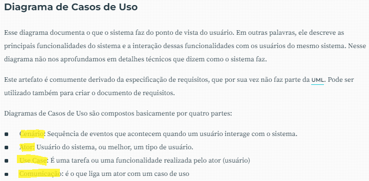
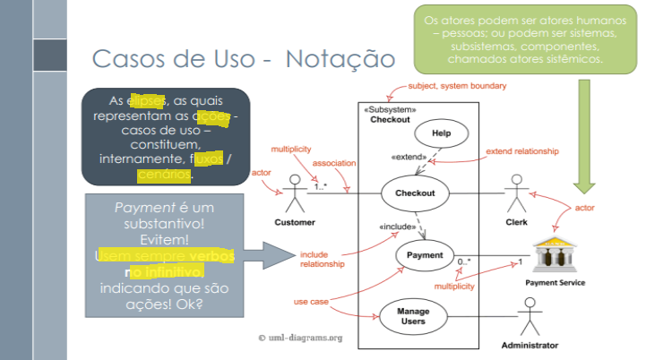
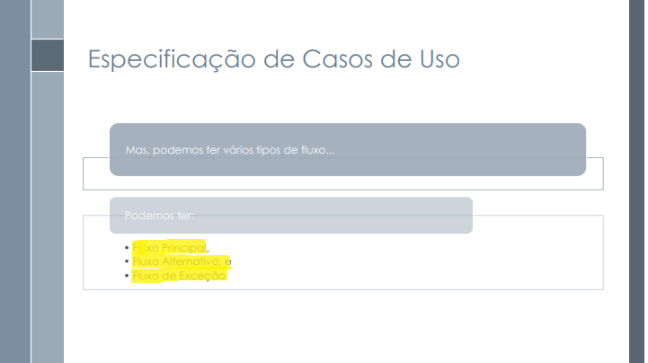
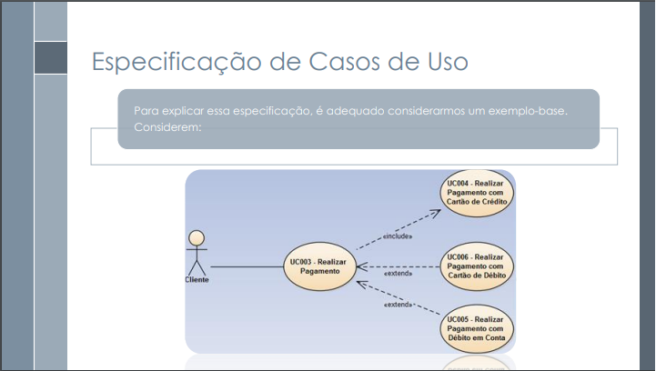

# Verificação do caso de uso

## Introdução

Nesta verificação será analisado o artefato Diagrama de Caso de Uso desenvolvidos pela equipe. A técnica de inspeção será aplicada para verificar esse artefato, de acordo com o planejamento estabelecido na metodologia. Na tabela 1, se encontra os metadados desse artefato, na tabela 2 se encontram as questões a serem avaliadas.

<center>

| Versão | Autor(es)  | Revisor(es)  |
| ---------------- | ------ | -------- |
| 1.0              | Artur Seppa | Ana Luíza |

</center>

<div style="text-align: center">
<p> Tabela 1: Metadados do artefato (Fonte: Ana Letícia, 2023). </p>
</div>

| ID |                                 Questão                                 | Inspeção |
| :-: | :-----------------------------------------------------------------------: | :--------: |
| 1 |                 As legendas estão no padrão do projeto?                 |     🟢     |
| 2 |                  Possui links para os outros artefatos?                  |     🟢     |
| 3 |                   Existe uma introdução no artefato?                   |     🟢     |
| 4 |                Existe tabela de versionamento padronizado?                |     🟢     |
| 5 |      Há referências bibliográficas ou referências no artefato?      |     🟢     |
| 6 | As tabelas e imagens possuem legenda, fonte e são introduzidas no texto? |     🟢     |
| 7 |                         O artefato possui autor?                         |     🟢     |
| 8 |                        O artefato possui revisor?                        |     🟢     |

<div style="text-align: center">
<p> Tabela 2: Tabela de avaliação geral para todos os artefatos (Fonte: Ana Letícia, 2023). </p>
</div>

| ID | Questão                                                    | UC Geral | UC01 | UC02 | UC03 | UC04 | UC05 | UC06 | UC07 | UC08 | UC09 | 
| -- | ----------------------------------------------------------- | -------- | ---- | ---- | ---- | ---- | ---- | ---- | ---- | ---- | ---- | 
| 9  | O diagrama possui cenários - sequência de eventos que acontecem quando um usuário interage com o sistema?[1]   | N/A      | 🟢   | 🟢   | 🟢   | 🟢   | 🟢   | 🟢   |🟢   | 🟢   | 🟢   | 
| 10 | O diagrama possui atores?[1] | N/A      | 🟢   | 🟢   | 🟢   | 🟢   | 🟢   | 🟢   |🟢   | 🟢   | 🟢   | O que é UML e Diagramas de Caso de Uso: Introdução Prática à UML, DEVMEDIA. |
| 11 | O diagrama representa tarefas e funcionalidades realizadas pelos atores?[1] | 🟢       | 🟢   | 🟢   | 🟢   | 🟢   | 🟢   | 🟢   |🟢   | 🟢   | 🟢   | 
| 12 | O diagrama representa as comunicações do sistema, ou seja, o que liga um ator a um caso de uso?[1]    | N/A      | 🟢   | 🟢   | 🟢   | 🟢   | 🟢   | 🟢   |🟢   | 🟢   | 🟢   | 
| 13 | A especificação do caso de uso possui pós-condição?[2]    | N/A      | 🟢   | 🟢   | 🟢   | 🟢   | 🟢   | 🟢   |🟢   | 🟢   | 🟢   |
| 14 | A especificação do caso de uso possui fluxo principal?[2]    | N/A      | 🟢   | 🟢   | 🟢   | 🟢   | 🟢   | 🟢   |🟢   | 🟢   | 🟢   |
| 15 | A especificação do caso de uso possui fluxo alternativo?[2]  | N/A      | 🟢   | 🟢   | 🟢   | 🟢   | 🟢   | 🟢   |🟢   | 🟢   | 🟢   |
| 16 | A especificação do caso de uso possui fluxo de exceção?[2] | N/A      | 🟢   | 🟢   | 🟢   | 🟢   | 🟢   | 🟢   |🟢   | 🟢   | 🟢   |
| 17 | Os verbos estão no infinitivo quando indicam as ações?[2]                             | N/A      | 🟢   | 🟢   | 🟢   | 🟢   | 🟢   | 🟢   |🟢   | 🟢   | 🟢   |
| 18 | As ações são representadas por elipses?[2]                             | N/A      | 🟢   | 🟢   | 🟢   | 🟢   | 🟢   | 🟢   |🟢   | 🟢   | 🟢   |
| 19 | O ator principal está do lado esquerdo do sistema nos diagramas?[2]                             | N/A      | 🟢   | 🟢   | 🟢   | 🟢   | 🟢   | 🟢   |🟢   | 🟢   | 🟢   |
| 20 | As setas nos diagramas indicam o fluxo corretamente?[2]                             | N/A      | 🟢   | 🟢   | 🟢   | 🟢   | 🟢   | 🟢   |🟢   | 🟢   | 🟢   |
<div style="text-align: center">
<p> Tabela 3: Tabela de avaliação com as questões específicas do artefato sobre as especificações (Fonte: Ana Letícia, 2023). </p>
</div>


### Tarefas

Não será necessário

## Acompanhamento

Para saber a porcentagem de aproveitamento do artefato, será utilizado a expressão definida na metologia.

<center>

</center>

### Porcentagem

Nos checklists realizados e que serão descritos, podemos observar que:

- 20/20 exigências são atendidas;
- 0/20 exigências estão incompletas;
- 0/20 exigências estão erradas ou não foram realizadas.
- 0/20 não se aplicam.

```vegalite
{
    "title": "Acompanhamento",
  "$schema": "https://vega.github.io/schema/vega-lite/v5.json",
  "description": "A simple donut chart with embedded data.",
  "data": {
    "values": [
      {"legenda": "Completo", "value": 20},
      {"legenda": "Incompleto", "value": 0},
      {"legenda": "Errado", "value": 0},
      {"legenda": "Não se aplica", "value": 0}
    ]
  },
  "mark": {"type": "arc", "innerRadius": 50, "tooltip": true},
  "encoding": {
    "theta": {"field": "value", "type": "quantitative"},
    "color": {
      "field": "legenda",
      "type": "nominal",
      "scale": {
        "domain": ["Completo", "Incompleto", "Errado", "Não se aplica"],
        "range": ["green", "yellow", "red", "blue"]
      }
    }
  }
}
```

<div style="text-align: center">
<p> Gráfico 1: Gráfico de aproveitamento (Fonte: Ana Letícia, 2023). </p>
</div>

Portanto, com base na formula apresentada, pode-se dizer que o aproveitamento deste artefato está em 100% correto.

</center>

## Referência Bibliorgráfica

>[1] O que é UML e Diagramas de Caso de Uso: Introdução Prática à UML, DEVMEDIA. [20--?]. Disponível em: <https://www.devmedia.com.br/o-que-e-uml-e-diagramas-de-caso-de-uso-introducao-pratica-a-uml/23408#:~:text=Pela%20definição%20de%20seu%20nome,modelar%20diversos%20aspectos%20dos%20sistemas>. Acesso em: 30 nov. 2023.

<div style="text-align: center;">
  
  
  <p> Figura 1: Diagrama de Caso de uso (Fonte: DevMedia, [20--?]. Grifos de Ana Letícia, 2023.). </p>
</div>

>[2] SERRANO, Milene. SERRANO, Maurício. Requisitos - Aula 13, Universidade de Brasília, Faculdade do Gama. Slides de aula. [20--?].

<div style="text-align: center;">
  
  
  <p> Figura 2: Especificações do Diagrama de Caso de uso (Fonte: SERRANO, Milene [20--?]. Grifos de Ana Letícia, 2023.). </p>
</div>

<div style="text-align: center;">
  
  
  <p> Figura 3: Tipos de Fluxo (Fonte: SERRANO, Milene [20--?]. Grifos de Ana Letícia, 2023.). </p>
</div>

<div style="text-align: center;">
  
  
  <p> Figura 4: Representação das setas no diagrama (Fonte: SERRANO, Milene [20--?]. Grifos de Ana Letícia, 2023.). </p>
</div>

## Histórico de versão

|    Data    | Versão |      Descrição      | Autor(es) | Revisor(es)
| :--------: | :-----: | :--------------------: | :-------: | ----------- |
| 03/12/2023 |   1.0   | Criação do documento |   Ana Letícia   | Artur Seppa |
