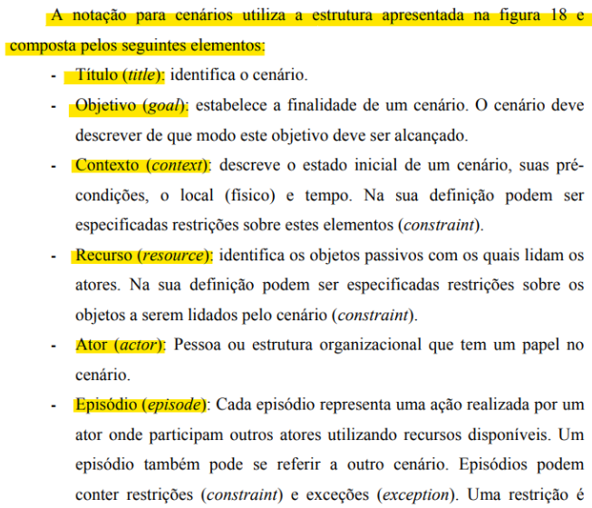

# Verificação de Cenários

## Introdução

Neste documento, será realizada a verificação do artefato cenários desenvolvido pela equipe. Sendo realizado a técnica de inspeção como forma de avaliação deste documento, além de seguir o planejamento previamente estabelecido. Na tabela 1, se encontra os metadados do arquivo desenvolvido, nas tabelas 2 e 3 pode ser visto as questões a serem avaliadas, enquanto na tabela 4 pode ser visto os elementos que precisam ser ajustados e no Gráfico 1 pode ser visto o quanto das exigências foram atendidas.

<center>

| Versão | Autor(es)              | Revisor(es)         |
| :----: | ---------------------- | ------------------- |
| `1.0`  | Ana Letícia e Raphaela | Edilberto Cantuaria |

<div style="text-align: center">
<p> Tabela 1: Metadados do artefato produzido. (Fonte: Artur e Edilberto, 2023). </p>
</div>

</center>

<center>

| ID  |                                 Questão                                  | Inspeção |
| :-: | :----------------------------------------------------------------------: | :------: |
|  1  |                 As legendas estão no padrão do projeto?                  |    🟢    |
|  2  |                  Possui links para os outros artefatos?                  |   N/A    |
|  3  |                    Existe uma introdução no artefato?                    |    🟢    |
|  4  |               Existe tabela de versionamento padronizado?                |    🟢    |
|  5  |        Há referências bibliográficas ou referências no artefato?         |    🟢    |
|  6  | As tabelas e imagens possuem legenda, fonte e são introduzidas no texto? |    🟢    |
|  7  |                         O artefato possui autor?                         |    🟢    |
|  8  |                        O artefato possui revisor?                        |    🟢    |

</center>
<div style="text-align: center">
<p> Tabela 2: Tabela de avaliação das verificações gerais do artefato. (Fonte: Artur e Edilberto, 2023). </p>
</div>

</center>

<center>

| ID  | Questão                                                                                                                                                                                                                                         | Inspeção |
| :-: | ----------------------------------------------------------------------------------------------------------------------------------------------------------------------------------------------------------------------------------------------- | :------: |
|  9  | O cenário proposto utiliza a notação composta pelos elementos: Título, Objetivo, Contexto, Recurso, Ator e Episódio ? [1]                                                                                     |    🟢    |
| 10  | O objetivo imposto nas notações, descreve de que modo ele deve ser alcançado no cenário ? [1]                                                                                                                 |    🟢    |
| 11  | O contexto do cenário imposto descreve os elementos cruciais de pré-condições, o local e o tempo ? [1]                                                                                                        |    🟢    |
| 12  | Os recursos impostos identificam os elementos passivos utilizados pelos atores para realizar suas atividades no cenário ? Exemplo: Internet e dispositivo computacional que executa o sistema em questão. [1] |    🟢    |
| 13  | Os atores nas notações podem ser identificados como uma pessoa ou estrutura organizacional que tem um papel no cenário ? [1]                                                                                  |    🟢    |
| 14  | Os episódios impostos representam uma ação realizada por um ator ou outro cenário no sistema ? Havendo a participação e a relação de atores com os recursos disponíveis ? [1]                                 |    🟢    |

<div style="text-align: center">
<p> Tabela 3: Tabela de avaliação das verificações específicas do artefato. (Fonte: Artur e Edilberto, 2023). </p>
</div>

</center>

<!--
<center>

### Tarefas

| ID Correção | Tarefa                                                                                   |
| ----------- | ---------------------------------------------------------------------------------------- |
| IDC1        | Ajustar a legenda da tabela 2 para ficar padronizada com os outros artefatos do projeto. |

<div style="text-align: center">
<p> Tabela 4: Tabela do que precisa ser ajustado (Fonte: Artur e Edilberto, 2023). </p>
</div>

</center>
-->

## Acompanhamento

Para saber a porcentagem de aproveitamento do artefato, será utilizado a expressão da Figura 1, no qual a Tabela 5 apresenta o significado dessa legendas.

<div style="text-align: center">


<p> Figura 1: Fórmula para calcular aproveitamento (Fonte: Ana Luíza, 2023). </p>
</div>

<center>

| Acrônimo | Descrição                      |
| -------- | ------------------------------ |
| QTDE     | Quantidade Total de Exigências |
| EC       | Exigências Completas           |

<div style="text-align: center">
<p> Tabela 5: Legenda da Figura 1 (Fonte: Ana Luíza, 2023). </p>
</div>

</center>

### Porcentagem

Nos checklists realizados e que serão descritos, podemos observar que:

- 14/15 exigências são atendidas;
- 0/15 exigências estão incompletas;
- 0/15 exigências estão erradas ou não foram realizadas;
- 1/15 exigências não se aplicam;

onde 15 é a quantidade de exigências.

```vegalite
{
    "title": "Acompanhamento",
  "$schema": "https://vega.github.io/schema/vega-lite/v5.json",
  "description": "A simple donut chart with embedded data.",
  "data": {
    "values": [
      {"legenda": "Completo", "value": 14},
      {"legenda": "Incompleto", "value": 0},
      {"legenda": "Não se aplica", "value": 1}
    ]
  },
  "mark": {"type": "arc", "innerRadius": 50, "tooltip": true},
  "encoding": {
    "theta": {"field": "value", "type": "quantitative"},
    "color": {
      "field": "legenda",
      "type": "nominal",
      "scale": {
        "domain": ["Completo", "Incompleto", "Não se aplica"],
        "range": ["green", "yellow", "gray"]
      }
    }
  }
}
```

<div style="text-align: center">
<p> Gráfico 1: Gráfico de aproveitamento (Fonte: Artur e Edilberto, 2023). </p>
</div>

Portanto, com base na fórmula apresentada, pode-se dizer que o aproveitamento deste artefato está em 93.3% correto.

### Correção

<center>

### Ajustes

Na tabela 6, se encontra os ajustes que o autor do artefato realizou para arrumar o que foi pedido na tabela 4.

| ID Correção | Ajuste                       |
| ----------- | ---------------------------- |
| IDC1        | Foi ajustado x realizando... |
| IDC2        | Foi incluido x em ...        |
| IDC3        | Foi removido x ...           |
| IDC4        | X foi especificaod melhor... |

<div style="text-align: center">
<p> Tabela 7: Tabela de ajustes feitos (Fonte: Ana Luíza, 2023). </p>
</div>

</center>

## Referência Bibliográfica

> [1] Página: 49, Capítulo 3. Cenários. PUC-Rio - Certificação Digital Nº 9716398/CA. Disponível em: <https://www-di.inf.puc-rio.br/~julio/bnncap3.pdf> Acesso em: 03 dezembro 2023. Sendo uma referência ilustrada na figura 2 no documento.

<div style="text-align: center;">
  
  
  <p> Figura 2: Atividades de elicitação (Fonte: PUC-Rio. p 49. Grifado por Artur Seppa Reiman, 2023). </p>
</div>

## Histórico de Versão

| Versão | Data       | Descrição                                             | Autor             | Revisor                |
| ------ | ---------- | ----------------------------------------------------- | ----------------- | ---------------------- |
| 1.0    | 25/11/2023 | Criação e desenvolvimento do documento de verificação | Artur e Edilberto | Ana Letícia e Raphaela |
