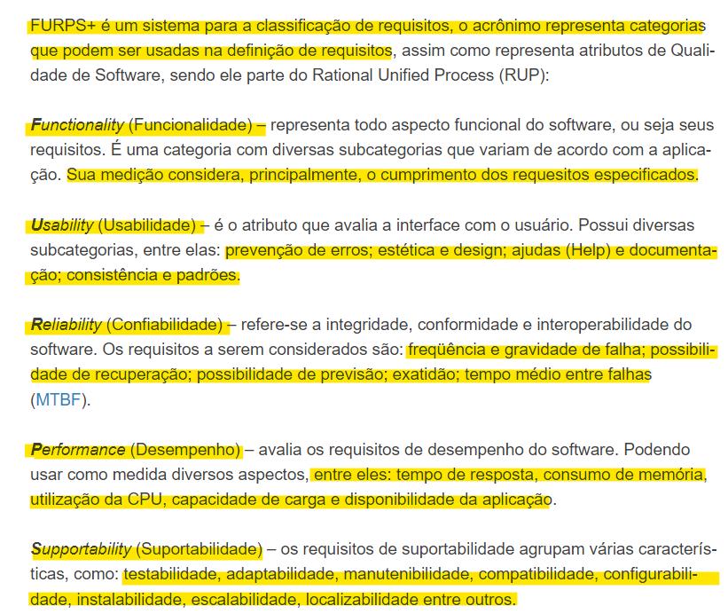
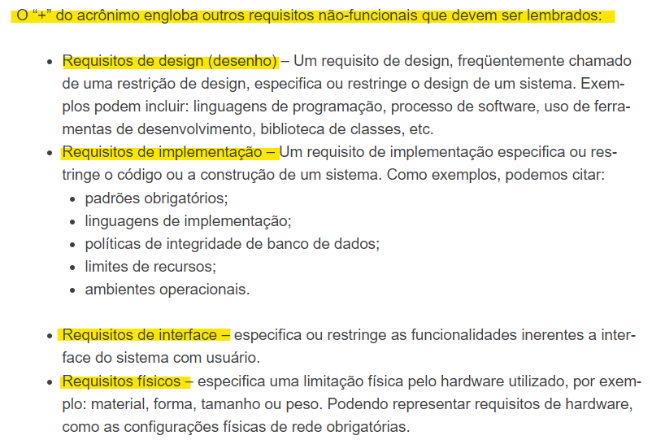
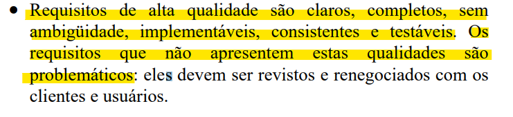

# Verificação da Especificação Suplementar

## Introdução

Neste documento, será realizada a verificação do artefato da especificação suplementar desenvolvido pela equipe. Sendo realizado a técnica de inspeção como forma de avaliação deste documento, além de seguir o planejamento previamente estabelecido. Na tabela 1, se encontra os metadados do arquivo desenvolvido, nas tabelas 2 e 3 pode ser visto as questões a serem avaliadas, enquanto na tabela 4 pode ser visto os elementos que precisam ser ajustados e no Gráfico 1 pode ser visto o quanto das exigências foram atendidas.

<center>

| Versão | Autor(es)           | Revisor(es)   |
| :----: | ------------------- | ------------- |
| `1.0`  | Edilberto Cantuaria | Rafael Xavier |

<div style="text-align: center">
<p> Tabela 1: Metadados do artefato produzido. (Fonte: Artur Seppa Reiman, 2023). </p>
</div>

</center>

<center>

| ID  |                                 Questão                                  | Inspeção
| :-: | :----------------------------------------------------------------------: | :------: |
|  1  |                 As legendas estão no padrão do projeto?                  |    🟡    |
|  2  |                  Possui links para os outros artefatos?                  |   🟡   |                                                       
|  3  |                    Existe uma introdução no artefato?                    |    🟢    |
|  4  |               Existe tabela de versionamento padronizado?                |    🟡    | 
|  5  |        Há referências bibliográficas ou referências no artefato?         |    🟢    |                  
|  6  | As tabelas e imagens possuem legenda, fonte e são introduzidas no texto? |    🟡    |                  
|  7  |                         O artefato possui autor?                         |    🟢    |                   
|  8  |                        O artefato possui revisor?                        |    🟢    |                  

</center>
<div style="text-align: center">
<p> Tabela 2: Tabela de avaliação das verificações gerais do artefato. (Fonte: Artur Seppa Reiman, 2023). </p>
</div>

</center>

<center>

| ID  | Questão                                                                                                                                                                                                                                                                                                                                                             | Inspeção | 
| :-: | :-----------------------------------------------------------------------------------------------------------------------------------------------------------------------------------------------------------------------------------------------------------------------------------------------------------------------------------------------------------------: | :------: |
| 9   | A fim de auxiliar na especificação suplementar do documento, foi utilizado a metodologia FURPS+ com as categorias de Funcionalidade, Usabilidade, Confiabilidade, Desempenho, Suportabilidade e demais requisitos não-funcionais para descrever os aspectos essenciais do software e ajudar na classificação dos requisitos de acordo com suas características ? [1]                                                                                          |   🟢      | 
| 10   | O documento possui um tópico referente as funcionalidades, respeitando o cumprimento dos requisitos elicitados no projeto ? [1]                                                                                                  | 🟢  |         
| 11   | Os requisitos de usabilidade estão em conformidade com os padrões comuns reconhecidos? Podendo ser abordado dentro dos requisitos os tópicos sobre a prevenção de erros, estética e design, formas de ajuda e documentação, consistência e padrões. [1]                                                                                                       | 🟢  | 
| 12   | No documento, os requisitos apresentados no tópico de Usabilidade são testáveis? [2]                                                                                                                              |    🟡     |                         
| 13  | Seguindo o aspecto da confiabilidade, os requisitos categorizados estão em conformidade com os padrões reconhecidos? Podendo ser abordado dentro dos requisitos os tópicos sobre a frequência e gravidade de falha, possibilidade de recuperação, possibilidade de previsão, exatidão e tempo médio entre falhas. [1]      |     🟢    |                         
| 14  | No documento, os requisitos apresentados no tópico de confiabilidade são testáveis?  [2]                                                                                          |    🟡     |                       
| 15  |  No documento, os requisitos de desempenho/performace estão em conformidade com os padrões comuns reconhecidos? Podendo ser abordado dentro dos requisitos os tópicos sobre o tempo de resposta, consumo de memória, utilização da CPU, capacidade de carga e disponibilidade da aplicação. [1]                                                                    |    🟢      |                       
| 16  | No documento, os requisitos apresentados no tópico de desempenho/performace são testáveis? [2]                                                                                            |  🟡 |
| 17  |  No contexto de suportabilidade, os requisitos categorizados estão em conformidade com os padrões reconhecidos? Podendo ser abordado dentro dos requisitos os tópicos sobre a testabilidade, adaptabilidade, manutenibilidade, compatibilidade, configurabilidade, instalabilidade, escalabilidade e localizabilidade. [1]                                                                      |    🟢     |                      
| 18  | No documento, os requisitos apresentados no tópico de suportabilidade são testáveis? [2]                                                                                            | 🟢 | 
| 19  | O documento aborda sobre as funcionalidades adicionais no sistema ? Podendo ser inferido os tópicos sobre os requsitos de design, de implementação, de interface, e de requisitos físicos. [1]                                                                                      | 🟢 |     


<div style="text-align: center">
<p> Tabela 3: Tabela de avaliação das verificações específicas do artefato. (Fonte: Artur Seppa Reiman, 2023). </p>
</div>

</center>


<center>

### Tarefas

| ID Correção | Tarefa         |
| ------------- | -------------- |
| IDC1          | Ajustar as legendas da tabelas para ficarem padronizada com os outros artefatos do projeto.     |
| IDC2          | Ajustar o redirecionamento do link incorreto da lista de requisitos priorizados que pode ser encontrado no tópico de Funcionalidade no documento.  |
| IDC3          | Corrigir o erro de digitação no título da coluna de autores da tabela de versionamento.  |
| IDC4          | Efetuar a introdução das tabelas 1, 3 e 4 no documento, corrigir as legendas desses elementos para ficar padronizado com todo o projeto e retirar as últimas linhas vazias nas tabelas 1, 2 e 3.  |
| IDC5          | Dentro da especificação de requisito de usabilidade os itens USA05 e USA07 poderiam ser mais especificos, a fim de retratar as funcionalidades do sistema de forma mais concisa para tornar os requisitos testáveis.   |
| IDC6          | Os requisitos abordados sobre o desempenho de sistema poderiam ser mais específicos, abordando de forma prática como deve ser feito o consumo de recursos e de navegação para torna-los testáveis. |
| IDC7          | Na especificação de requisito de confiabilidade a descrição dos requisitos abordados poderia ser mais acurada, especificando mais a forma de recuperação de falhas no sistema, indicando de forma breve como pode ser feita para torna-lá testável.  |

<div style="text-align: center">
<p> Tabela 4: Tabela do que precisa ser ajustado (Fonte: Artur Seppa Reiman, 2023). </p>
</div>

</center>

## Acompanhamento

Para saber a porcentagem de aproveitamento do artefato, será utilizado a expressão da Figura 1, no qual a Tabela 5 apresenta o significado dessa legendas.

<div style="text-align: center">


<p> Figura 1: Fórmula para calcular aproveitamento (Fonte: Ana Luíza, 2023). </p>
</div>

<center>

| Acrônimo  | Descrição                      |
| --------- | ------------------------------ |
| QTDE      | Quantidade Total de Exigências |
| EC        | Exigências Completas           |

<div style="text-align: center">
<p> Tabela 5: Legenda da Figura 1 (Fonte: Ana Luíza, 2023). </p>
</div>

</center>

### Porcentagem

Nos checklists realizados e que serão descritos, podemos observar que:

- 12/19 exigências são atendidas;
- 7/19 exigências estão incompletas;
- 0/19 exigências estão erradas ou não foram realizadas.

onde 19 é a quantidade de exigências.

```vegalite
{
    "title": "Acompanhamento",
  "$schema": "https://vega.github.io/schema/vega-lite/v5.json",
  "description": "A simple donut chart with embedded data.",
  "data": {
    "values": [
      {"legenda": "Completo", "value": 12},
      {"legenda": "Incompleto", "value": 7}
    ]
  },
  "mark": {"type": "arc", "innerRadius": 50, "tooltip": true},
  "encoding": {
    "theta": {"field": "value", "type": "quantitative"},
    "color": {
      "field": "legenda",
      "type": "nominal",
      "scale": {
        "domain": ["Completo", "Incompleto", "Errado"],
        "range": ["green", "yellow", "red"]
      }
    }
  }
}
```

<div style="text-align: center">
<p> Gráfico 1: Gráfico de aproveitamento (Fonte: Artur Seppa Reiman, 2023). </p>
</div>

Portanto, com base na fórmula apresentada, pode-se dizer que o aproveitamento deste artefato está em 63.20% correto.

### Correção

<center>

### Ajustes

Na tabela 6, se encontra os ajustes que o autor do artefato realizou para arrumar o que foi pedido na tabela 4.

| ID Correção | Ajuste                       |
| ------------- | ---------------------------- |
| IDC1          | Ajuste nas tabelas e legendas para ficar de acordo com o padrão do projeto |
| IDC2          | O link que redireciona para o artefato introspecção foi corrigido         |
| IDC3          | As tabelas e figuras são invocadas ao longo do texto        |
| IDC4          | Melhor detalhamento nos requistos para evitar generalidades, conferindo uma maior qualidade de testabilidade aos requisitos elicitados |

<div style="text-align: center">
<p> Tabela 6: Tabela de ajustes feitos (Fonte: Ana Luíza, 2023). </p>
</div>

</center>

## Referências Bibliográficas

> [1] FERRARI, Fabrício. FURPS+. Qualidade BR, 06 de maio de 2023. Disponível em: https://qualidadebr.wordpress.com/2008/07/10/furps/. Acesso em: 26 novembro 2023. Sendo uma referência ilustrada na figura 2 e 3 no documento. 

<div style="text-align: center;">
  
  
  <p> Figura 2: Modelo FURPS (Fonte: FERRARI, Fabrício. Grifos de Artur Seppa Reiman). </p>
</div>

<div style="text-align: center;">
  
  
  <p> Figura 3: acrônimo "+" de FURPS+ (Fonte: FERRARI, Fabrício. Grifos de Artur Seppa Reiman). </p>
</div>

> [2] MESQUITA, Renato Cardoso. 3. Engenharia dos
requisitos de software. Disponível em: https://www.cin.ufpe.br/~joa/menu_options/school/cursos/engsoft/aulas/requisitos-conceitos.pdf. Acesso em: 28 novembro 2023. Sendo uma referência ilustrada na figura 4 no documento.

<div style="text-align: center;">
  
  
  <p> Figura 4: requisitos testáveis (Fonte: MESQUITA, Renato Cardoso. Grifos de Artur Seppa Reiman). </p>
</div>

## Histórico de Versão

| Versão | Data       | Descrição                                             | Autor              | Revisor       |
| ------ | ---------- | ----------------------------------------------------- | ------------------ | ------------- |
| 1.0    | 27/11/2023 | Criação e desenvolvimento do documento de verificação | Artur Seppa Reiman | Edilberto Cantuaria |
| 1.1    | 06/12/2023 | Modificação na tabela de ajustes | Edilberto Cantuaria | Artur Seppa Reiman |
