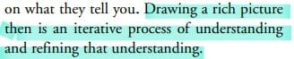
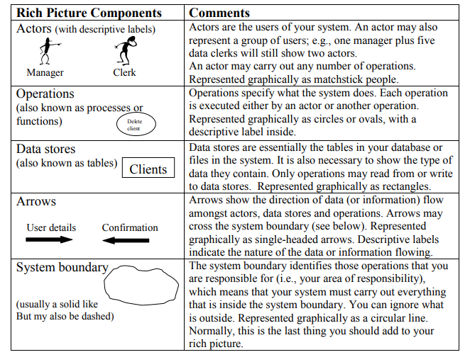
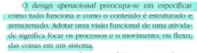
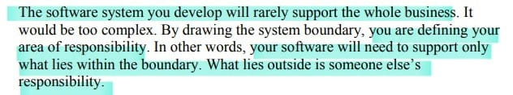
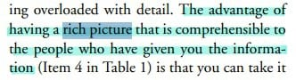

# Verificação Rich Picture

## Introdução

O presente documento apresentará a verificação do [Rich Picture](https://requisitos-de-software.github.io/2023.2-LibreOffice/planejamento/appEscolhido/#rich-picture) desenvolvido pela equipe. É necessário esclarecer que o RIch Picture se encontra dentro do artefato Aplicativo Escolhido, mas neste documento será avaliado somente o Rich picture separadamente, que foi feito pela Ana Letícia e pela Raphaela. A técnica de inspeção será aplicada para verificar esse artefato, de acordo com o planejamento estabelecido. Na tabela 1, se encontra os metadados do artefato em que se encontra o Rich Picture, na tabela 2 se encontram as questões a serem avaliadas e no Gráfico 1, o quanto das exigências foram atendidas.

## Cronograma e participantes

Para efetuar a inspeção e verificação do documento a integrante Ana Luíza realizou uma gravação dessa atividade para ter uma melhor elucidação e visão da inspeção efetuada do documento. Portanto como cronograma seguido, foi efetuado uma gravação via Teams às 21:15 do dia 26 de novembro de 2023, como pode ser visto no vídeo 1.

<center>

<iframe width="560" height="315" src="https://www.youtube.com/embed/OKCcG8lyJCA?si=1zilH2iEBPhEDt4_" title="YouTube video player" frameborder="0" allow="accelerometer; autoplay; clipboard-write; encrypted-media; gyroscope; picture-in-picture; web-share" allowfullscreen></iframe>

<div style="text-align: center">
<p> Vídeo 1: Gravação da verificação do Rich Picture. (Fonte: Ana Luíza, 2023). </p>
</div>

</center>

## Verificação

<center>

| Versão  |  Autor(es) | Revisor(es) | 
| :----: | :--------: | :---------: |
| 1.0    | Ana Luíza | Rafael |

<div style="text-align: center">
<p> Tabela 1: Metadados do artefato produzido. (Fonte: Ana Luíza, 2023). </p>
</div>

</center>

O documento não apresentará as questões gerais do artefato, pois aqui está sendo analisado apenas o Rich Picture. Desse modo, serão apresentadas apenas questões específicas relacionadas ao Rich Picture.

<center>

|  ID   |                                      Questão                              | Inspeção |
| :---: | :-----------------------------------------------------------------------: | :------: |
|   1   |  O Rich Picture possui várias versões atualizadas e aprimoradas ao longo do tempo? <a href="#REF1">[1]</a>   |  🟡 |
|   2   |  O Rich Picture possui uma legenda com os símbolos usados no diagrama? <a href="#REF2">[2]</a>    |    🔴     |
|   3   |        O Rich Picture possui operações e armazenamentos bem definidos? <a href="#REF3">[3]</a>   |    🟢     |
|   4   |                         O desenho possui fronteiras? <a href="#REF4">[4]</a>                      |    🟢     |
|   5   |                    Os atores estão fora da fronteira? <a href="#REF4">[4]</a>                    |    🟢     | 
|   6   |       O Rich Picture mostra as principais funcionalidades do sistema? <a href="#REF4">[4]</a>    |    🟢     |
|   7   |                         O artefato está bem desenhado? <a href="#REF5">[5]</a>                   |    🟢     |
|   8   | Todos os 5 elementos de um Rich Picture (atores,operações,armazenamento de dados,fluxo de dados e limite do sistema) estão presentes no diagrama? <a href="#REF2">[2]</a>|    🟡     |

</center>

<div style="text-align: center">
<p> Tabela 2: Tabela de avaliação das verificações específicas. (Fonte: Ana Luíza, 2023). </p>
</div>

## Tarefas

<center>

| ID Correção | Tarefa         |
| ------------- | -------------- |
| IDC1          | Incluir histórico de versões do Rich Picture, versões anteriores ou posteriores, ou indicar se a versão presente no documento foi a única feita.  |
| IDC2          | Incluir legenda explicando os símbolos utilizados no Rich Picture.       |
| IDC3          | Fazer um artefato separado somente para o Rich Picture. |

</center>
<div style="text-align: center">
<p> Tabela 3: Tabela de ajustes a serem feitos. (Fonte: Ana Luíza, 2023). </p>
</div>

## Acompanhamento

Para saber a porcentagem de aproveitamento do artefato, será utilizado a expressão da Figura 1, no qual a Tabela 4 apresenta o significado dessa legendas.

<div style="text-align: center">


<p> Figura 1: Fórmula para calcular aproveitamento (Fonte: Ana Luíza, 2023). </p>
</div>

<center>

| Acrônimo  | Descrição                      |
| --------- | ------------------------------ |
| QTDE      | Quantidade Total de Exigências |
| EC        | Exigências Completas           |

<div style="text-align: center">
<p> Tabela 4: Legenda da Figura 1 (Fonte: Ana Luíza, 2023). </p>
</div>

</center>

### Porcentagem

Nos checklists realizados e que serão descritos, podemos observar que:

- 5/8 exigências são atendidas;
- 2/8 exigências estão incompletas;
- 1/8 exigências estão erradas ou não foram realizadas.

onde 8 é a quantidade de exigências.

```vegalite
{
    "title": "Acompanhamento",
  "$schema": "https://vega.github.io/schema/vega-lite/v5.json",
  "description": "A simple donut chart with embedded data.",
  "data": {
    "values": [
      {"legenda": "Completo", "value": 5},
      {"legenda": "Incompleto", "value": 2},
      {"legenda": "Errado", "value": 1}
    ]
  },
  "mark": {"type": "arc", "innerRadius": 50, "tooltip": true},
  "encoding": {
    "theta": {"field": "value", "type": "quantitative"},
    "color": {
      "field": "legenda",
      "type": "nominal",
      "scale": {
        "domain": ["Completo", "Incompleto", "Errado"],
        "range": ["green", "yellow", "red"]
      }
    }
  }
}
```

<div style="text-align: center">
<p> Gráfico 1: Gráfico de aproveitamento (Fonte: Ana Luíza, 2023). </p>
</div>

Portanto, com base na formula apresentada, pode-se dizer que o aproveitamento deste artefato está em 62,5% correto.

## Correção 

### Ajustes

Na tabela 5, se encontra os ajustes que o autor do artefato realizou para arrumar o que foi pedido na tabela 4.

| ID Correção | Ajuste                       |
| ------------- | ---------------------------- |
| IDC1          | Foi ajustado x realizando... |
| IDC2          | Foi incluido x em ...        |
| IDC3          | Foi removido x ...           |
| IDC4          | X foi especificaod melhor... |

<div style="text-align: center">
<p> Tabela 5: Tabela de ajustes feitos (Fonte: Ana Luíza, 2023). </p>
</div>

</center>

## Referência Bibliográfica

> <p id="REF1">[1] HOWARD, Andrew Monk. Steve." The Rich Picture: A Tool for Reasoning About Work Context." Interactions, p. 22.</p>

<div style="text-align: center;">
  

  <p> Figura 2: Versionamento do Rich Picture (Fonte: Ana Luíza, 2023). </p>
</div>

> <p id="REF2">[2] Introducing Rich Pictures - Rich Picture Drawing Guidelines, p. 4.</p>

<div style="text-align: center;">
  

  <p> Figura 3: 5 componentes do Rich Picture (Fonte: Ana Luíza, 2023). </p>
</div>

> <p id="REF3">[3] BENYON, David. Interação humano-computador. Traduçao de Heloısa Coimbra de Souza. 2a. ed. Sao Paulo: Person Prentice Hall, p. 30, 2011.</p>

<div style="text-align: center;">
  

  <p> Figura 4: Design operacional (Fonte: Ana Luíza, 2023). </p>
</div>

> <p id="REF4">[4] Introducing Rich Pictures - Rich Picture Drawing Guidelines, p. 5.</p>

<div style="text-align: center;">
  

  <p> Figura 5: Fronteira do sistema (Fonte: Ana Luíza, 2023). </p>
</div>

> <p id="REF5">[5] HOWARD, Andrew Monk. Steve." The Rich Picture: A Tool for Reasoning About Work Context." Interactions, p. 24.</p>

<div style="text-align: center;">
  

  <p> Figura 6: Simplicidade (Fonte: Ana Luíza, 2023). </p>
</div>


## Bibliografia

> MONK, Andrew; HOWARD, Steve. The Rich Picture: A Tool for Reasoning About Work Context. Interactions, [S.l.], v. 5, n. 2, p. 21-30, mar. 1998. Disponível em: [https://www.ics.uci.edu/~wscacchi/Software-Process/Readings/RichPicture.pdf](https://www.ics.uci.edu/~wscacchi/Software-Process/Readings/RichPicture.pdf) . Acesso em: 20 jun. 2023.

> Software Development Project: Introducing Rich Pictures. Disponível em: [https://aprender3.unb.br/pluginfile.php/2523045/mod_resource/content/2/1_5145791542719414573.pdf](https://aprender3.unb.br/pluginfile.php/2523045/mod_resource/content/2/1_5145791542719414573.pdf). Acesso em: 20 jun. 2023.

## Histórico de versão

|    Data    | Versão |      Descrição       | Autor(es) | Revisor(es) |
| :--------: | :----: | :------------------: | :-------: | :---------: |
| 26/11/2023 |  1.0   | Criação do documento | Ana Luíza |   Rafael    |
| 04/12/2023 |  1.1   | Adicionando referências | Ana Luíza |   Ana Letícia e Raphaela    |

